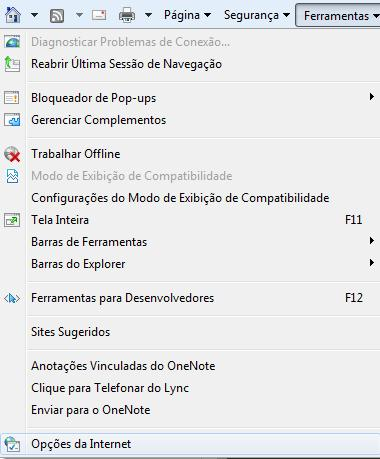
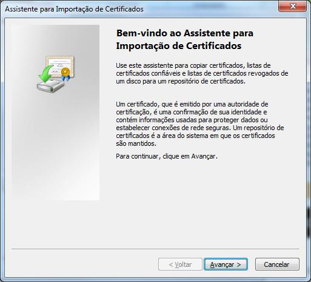
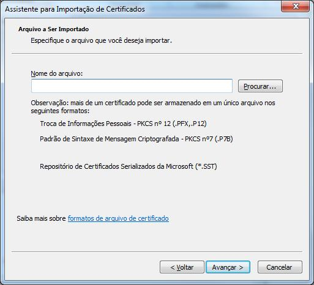
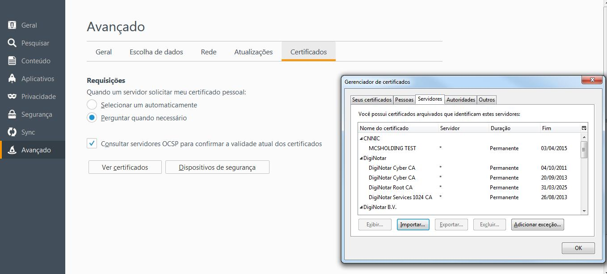
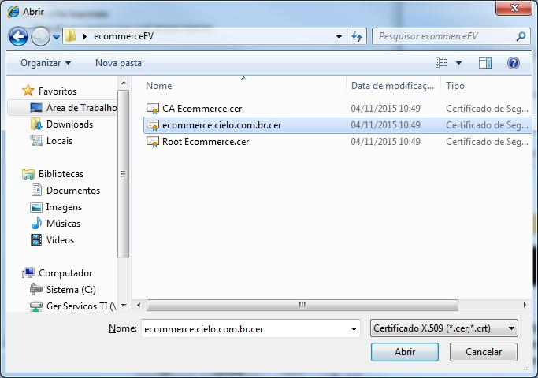
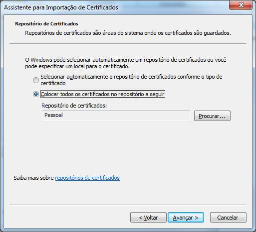
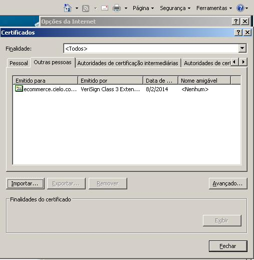

# Integração API 3.0

O objetivo desta documentação é orientar o desenvolvedor sobre como integrar com o API 3.0 da Cielo, descrevendo as funcionalidades, os métodos a serem utilizados, listando informações a serem enviadas e recebidas, e provendo exemplos.

O mecanismo de integração com o Cielo eCommerce é simples, de modo que apenas conhecimentos intermediários em linguagem de programação para Web, requisições HTTP/HTTPS e manipulação de arquivos JSON, são necessários para implantar a solução Cielo eCommerce com sucesso.

Nesse manual você encontrará a referência sobre todas as operações disponíveis na API REST do API 3.0. Estas operações devem ser executadas utilizando sua chave específica (Merchant ID e Merchant Key) nos respectivos endpoints dos ambientes:

Ambiente Produção

* **Requisição de transação**: https://api.cieloeCommerce.cielo.com.br/
* **Consulta transação**: https://apiquery.cieloeCommerce.cielo.com.br/

Ambiente Sandbox

* **Requisição de transação**: https://apisandbox.cieloeCommerce.cielo.com.br
* **Consulta transação**: https://apiquerysandbox.cieloeCommerce.cielo.com.br

Para executar uma operação, combine a URL base do ambiente com a URL da operação desejada e envie utilizando o verbo HTTP conforme descrito na operação.

## Suporte Cielo

Após a leitura deste manual, caso ainda persistam dúvidas (técnicas ou não), a Cielo disponibiliza o suporte técnico 24 horas por dia, 7 dias por semana em idiomas (Português e Inglês), nos seguintes contatos:

* +55 4002-9700 – *Capitais e Regiões Metropolitanas*
* +55 0800-570-1700 – *Demais Localidades*
* +55 11 2860-1348 – *Internacionais*
  * Opção 1 – *Suporte técnico;*
  * Opção 2 – *Credenciamento eCommerce.*
* Email: [cieloeCommerce@cielo.com.br](mailto:cieloeCommerce@cielo.com.br)

## Glossário

Para facilitar o entendimento, listamos abaixo um pequeno glossário com os principais termos relacionados ao eCommerce, ao mercado de cartões e adquirencia:

* **Autenticação**: processo para assegurar que o comprador é realmente aquele quem diz ser (portador legítimo), geralmente ocorre no banco emissor com uso de um token digital ou cartão com chaves de segurança.
* **Autorização**: processo para verificar se uma compra pode ou não ser realizada com um cartão. Nesse momento, são feitas diversas verificações com o cartão e com o portador (ex.: adimplência, bloqueios, etc.) É também neste momento que o limite do cartão é sensibilizado com o valor da transação.
* **Cancelamento**: processo para cancelar uma compra realizada com cartão.
* **Captura**: processo que confirma uma autorização que foi realizada previamente. Somente após a captura, é que o portador do cartão poderá visualizá-la em seu extrato ou fatura.
* **Chave de acesso**: é um código de segurança específico de cada loja, gerado pela Cielo, usada para realizar a autenticação e comunicação em todas as mensagens trocadas com a Cielo. Também conhecido como chave de produção e key data.
* **Comprador**: é o aquele que efetua compra na loja virtual.
* **Emissor (ou banco emissor)**: É a instituição financeira que emite o cartão de crédito, débito ou voucher.
* **Estabelecimento comercial ou EC**: Entidade que responde pela loja virtual.
* **Gateway de pagamentos**: Empresa responsável pelo integração técnica e processamento das transações.
* **Número de credenciamento**: é um número identificador que o lojista recebe após seu credenciamento junto à Cielo.
* **Portador**: é a pessoa que tem o porte do cartão no momento da venda.
* **SecureCode**: programa internacional da Mastercard para possibilitar a autenticação do comprador no momento de uma compra em ambiente eCommerce.
* **TID (Transaction Identifier)**: código composto por 20 caracteres que identificada unicamente uma transação Cielo eCommerce.
* **Transação**: é o pedido de compra do portador do cartão na Cielo.
* **VBV (Verified by Visa)**: Programa internacional da Visa que possibilita a autenticação do comprador no momento de uma compra em ambiente eCommerce.

# Certificado Extended Validation

## O que é Certificado SSL?

O Certificado SSL para servidor web oferece autenticidade e integridade dos dados de um web site, proporcionando aos clientes das lojas virtuais a garantia de que estão realmente acessando o site que desejam, e não uma um site fraudador.

Empresas especializadas são responsáveis por fazer a validação do domínio e, dependendo do tipo de certificado, também da entidade detentora do domínio.

### Internet Explorer:


### Firefox


### Google Chrome


## O que é Certificado EV SSL?

O Certificado EV foi lançado no mercado recentemente e garante um nível de segurança maior para os clientes das lojas virtuais.

Trata-se de um certificado de maior confiança e quando o https for acessado a barra de endereço ficará verde, dando mais confiabilidade aos visitantes do site.

## Como instalar o Certificado Extended Validation no servidor da Loja?

Basta instalar os três arquivos a seguir na Trustedstore do servidor. A Cielo não oferece suporte para a instalação do Certificado. Caso não esteja seguro sobre como realizar a instalação do Certificado EV, então você deverá ser contatado o suporte do fornecedor do seu servidor.

* [Certificado Raiz](./attachment/Raiz.crt)
* [Certificado Intermediária](./attachment/Intermediaria.crt)
* [Certificado E-Commerce Cielo](./attachment/eCommerce.cielo.com.br.crt)

<aside class="notice">Caso seu servidor seja uma distribuição Linux e você tenha familiaridade e acesso ssh, então o <a href="./attachment/cielo.sh">Instalador Linux - cielo.sh</a> poderá ajudá-lo com a instalação. <strong>Apenas utilize o instalador se você souber o que está fazendo</strong>. Na dúvida, entre em contato com o suporte do fornecedor do seu servidor.</aside>

## Passo a Passo para a Instalação

### Instalação no Servidor da Loja Virtual

O passo a passo para a instalação do Certificado EV deverá ser contatado o suporte do fornecedor do seu servidor.

<aside class="warning">A Cielo não oferece suporte para a instalação do Certificado.</aside>

### Acesso do Cliente à Loja Virtual

Normalmente, o browser faz a atualização do Certificado automaticamente, caso não o faça e o cliente entre em contato deverá ser informado os seguintes passos:

#### 1o Passo:

Salvar os três arquivos abaixo em uma pasta nova, ou que relembre facilmente, pois será utilizada posteriormente:

* [Certificado Raiz](./attachment/Raiz.crt)
* [Certificado Intermediária](./attachment/Intermediaria.crt)
* [Certificado E-Commerce Cielo](./attachment/eCommerce.cielo.com.br.crt)

#### 2o Passo:

No “Internet Explorer”, clique no menu “Ferramentas” e acesse as “Opções da Internet”:



No “Firefox”, clique no menu “Abrir Menu” e acesse “Avançado” e “Opções”:


No “Chrome”, clique no “Personalizar e Controlar o Google Chrome” e acesse “Configurações” e “Mostrar configurações avançadas... “Alterar Configurações de Proxy e “Conteúdo” e Certificados:


#### 3o Passo:

No Internet Explorer, em “Certificados”, clique em “Importar”.


No Firefox clique em “Ver Certificados”, clique em “Importar”


No Chrome clique em “Gerenciar Certificados”, clique em “Importar”


#### 4o Passo:

No Internet Explorer e Chrome “Assistente para Importação de Certificados”, clique em “Avançar”.





No Firefox “Aba Servidores ”, clique em “Importar”



#### 5o Passo:

No Chrome e Internet Explorer “Assistente para Importação de Certificados”, clique em “Procurar”, procure a pasta onde estão os arquivos e selecione o arquivo “eCommerce.cielo.com.br.crt, clique em “Abrir” e em seguida “Avançar”.




#### 6o Passo:

Selecionar a opção desejada: adicionar o Certificado em uma pasta padrão ou procurar a pasta de sua escolha.



#### 7o Passo:

Clique em “Concluir”.


#### 8o Passo:

Clique em “Ok” para concluir a importação.


<aside class="notice">No Firefox não consta a mensagem de Importação com Êxito, apenas conclui a importação.</aside>

O Certificado poderá ser visualizado na aba padrão “Outras Pessoas” ou na escolhida pelo cliente.



#### 9o Passo:

Repita o mesmo procedimento para os 3 arquivos enviados.

## Dúvidas

Em caso de dúvidas em qualquer etapa ou outras informações técnicas, entre em contato com o Suporte Web do Cielo e-Commerce nos seguintes canais:

* **Email:** [cieloeCommerce@cielo.com.br](mailto:cieloeCommerce@cielo.com.br)
* **Capitais:** 4002-9700
* **Demais Cidades:** 0800 570 1700

Horário de atendimento: 24h por dia, 7 dias por semana.

# Visão Geral

Neste manual será apresentado uma visão geral do Cielo eCommerce e o mecanismo tecnológico no formato de integração REST.

Para todo pedido de compra, a meta é efetivá-la em uma venda. Uma venda com cartão pode ser caracterizado em uma transação **autorizada e capturada**.

<aside class="warning">Uma transação autorizada somente gera o crédito para o lojista se ela for capturada (ou confirmada).</aside>

## Características da solução

A solução API 3.0 da plataforma Cielo eCommerce foi desenvolvida com a tecnologia REST, que é padrão de mercado e independe da tecnologia utilizada por nossos clientes. Dessa forma, é possível integrar-se utilizando as mais variadas linguagens de programação, tais como: ASP, ASP. Net, Java, PHP, Ruby, Python, etc.

Entre outras características, os atributos que mais se destacam na plataforma Cielo eCommerce:

* **Ausência de aplicativos proprietários**: não é necessário instalar aplicativos no ambiente da loja virtual em nenhuma hipótese.
* **Simplicidade**: o protocolo utilizado é puramente o HTTPS.
* **Facilidade de testes**: a plataforma Cielo oferece um ambiente Sandbox publicamente acessível, que permite ao desenvolvedor a criação de uma conta de testes sem a necessidade de credenciamento, facilitando e agilizando o início da integração.
* **Credenciais**: o tratamento das credenciais do cliente (número de afiliação e chave de acesso) trafega no cabeçalho da requisição HTTP da mensagem.
* **Segurança**: a troca de informações se dá sempre entre o Servidor da Loja e da Cielo, ou seja, sem o browser do comprador.
* **Multiplataforma**: a integração é realizada através de Web Service REST.

## Arquitetura

A integração é realizada através de serviços disponibilizados como Web Services. O modelo empregado é bastante simples: Existem duas URLs (endpoint), uma específica operações que causam efeitos colaterais - como autorização, captura e cancelamento de transações, e uma URL específica para operações que não causam efeitos colaterais, como pesquisa de transações. Essas duas URLs receberão as mensagens HTTP através dos métodos POST, GET ou PUT. Cada tipo de mensagem deve ser enviada para um recurso identificado através do path.

* **POST** - O método HTTP POST é utilizado na criação dos recursos ou no envio de informações que serão processadas. Por exemplo, criação de uma transação.
* **PUT** - O método HTTP PUT é utilizado para atualização de um recurso já existente. Por exemplo, captura ou cancelamento de uma transação previamente autorizada.
* **GET** - O método HTTP GET é utilizado para consultas de recursos já existentes. Por exemplo, consulta de transações.

## Sandbox

Para facilitar os testes durante a integração, a Cielo oferece um ambiente Sandbox que é composto por duas áreas:

1. Cadastro de conta de testes
2. Endpoints transacionais

    * **Requisição**: https://apisandbox.cieloeCommerce.cielo.com.br
    * **Consulta**: https://apiquerysandbox.cieloeCommerce.cielo.com.br/

Não é necessário uma afiliação para utilizar o Sanbox Cielo. Basta acessar o [Cadastro do Sandbox](https://cadastrosandbox.cieloeCommerce.cielo.com.br/) e criar uma conta de testes. Ao fim do cadastro você receberá um `MerchantId` e um `MerchantKey`, que deverão ser utilizados para autenticar todas as requisições feitas para os endpoints da API.

### Meio de Pagamento Simulado

O Simulado é um meio de pagamento que emula a utilizaçao de pagamentos com Cartão de Crétido. Com esse meio de pagamento é possivel simular todos os fluxos de Autorização, Captura e Cancelamento.

Para melhor utilização do Meio de Pagamento Simulado, estamos disponibilizando cartões de testes na tabela abaixo.

Os status das transações serão conforme a utilização de cada cartão.

|Status da Transação|Cartões para realização dos testes|Código de Retorno|Mensagem de Retorno|
|-------------------|----------------------------------|-----------------|-------------------|
|Autorizado|0000.0000.0000.0001 / 0000.0000.0000.0004|4|Operação realizada com sucesso|
|Não Autorizado|0000.0000.0000.0002|2|Não Autorizada|
|Autorização Aleatória|0000.0000.0000.0009|4 / 99|Operation Successful / Time Out|
|Não Autorizado|0000.0000.0000.0007|77|Cartão Cancelado|
|Não Autorizado|0000.0000.0000.0008|70|Problemas com o Cartão de Crédito|
|Não Autorizado|0000.0000.0000.0005|78|Cartão Bloqueado|
|Não Autorizado|0000.0000.0000.0003|57|Cartão Expirado|
|Não Autorizado|0000.0000.0000.0006|99|Time Out|

As informações de Cód.Segurança (CVV) e validade podem ser aleatórias, mantendo o formato - CVV (3 dígitos) Validade (MM/YYYY).

# Pagamentos com Cartão de Crédito

Para que você possa disfrutar de todos os recursos disponíveis em nossa API, é importante que antes você conheça os conceitos envolvidos no processamento de uma transação de cartão de crédito.

* **Autorização**: A autorização (ou pré-autorização) é a principal operação no eCommerce, pois através dela é que uma venda pode ser concretizada. A pré-autorização apenas sensibiliza o limite do cliente, mas ainda não gera cobrança para o consumidor.
* **Captura**: Ao realizar uma pré-autorização, é necessário a confirmação desta para que a cobrança seja efetivada ao portador do cartão. Através desta operação que se efetiva uma pré-autorização, podendo esta ser executada, em normalmente, em até 5 dias após a data da pré-autorização.
* **Cancelamento**: O cancelamento é necessário quando, por algum motivo, não se quer mais efetivar uma venda. No caso de uma pré-autorização, o cancelamento irá liberar o limite do cartão que foi sensibilizado em uma pré-autorização. Quando a transação já estiver sido capturada ou for uma Autorização, o cancelamento irá desfazer a venda, mas deve ser executado até às 23:59:59 da data da autorização/captura.
* **Autenticação**: O processo de autenticação possibilita realizar uma venda a qual passará pelo processo de autenticação do banco emissor do cartão, assim trazendo mais segurança para a venda e transferindo para o banco, o risco de fraude.
* **Cartão protegido**: É uma plataforma que permite o armazenamento seguro de dados sensíveis de cartão de crédito. Estes dados são transformados em um código criptografrado chamado de "token”, que poderá ser armazenado em banco de dados. Com a plataforma, a loja poderá oferecer recursos como "Compra com 1 clique” e "Retentativa de envio de transação”, sempre preservando a integridade e a confidencialidade das informações.
* **Antifraude**: É uma plataforma de prevenção à fraude que fornece uma análise de risco detalhada das compras on-line. Cada transação é submetida a mais de 260 regras, além das regras específicas de cada segmento, e geram uma recomendação de risco em aproximadamente dois segundos. Este processo é totalmente transparente para o portador do cartão. De acordo com os critérios preestabelecidos, o pedido pode ser automaticamente aceito, recusado ou encaminhado para análise manual.
* **Recorrente**: A Recorrência Inteligente é um recurso indispensável para estabelicimentos que precisam cobrar regularmente por seus produtos/serviços.
É muito utilizado para assinaturas de revistas, mensalidades, licenças de software, entre outros. Os lojistas contarão com recursos diferenciados para modelar sua cobrança de acordo com o seu negócio, pois toda parametrização é configurável, tais como: periodicidade, data de início e fim, quantidade de tentativas, intervalo entre elas, entre outros.

## Criando uma transação simples

Para criar uma transação que utilizará cartão de crédito, é necessário enviar uma requisição utilizando o método `POST` para o recurso Payment, conforme o exemplo. Esse exemplo contempla o mínimo de campos necessários a serem enviados para a autorização.

### Requisição

<aside class="request"><span class="method post">POST</span> <span class="endpoint">/1/sales/</span></aside>

```json
{
   "MerchantOrderId":"2014111703",
   "Customer":{
      "Name":"Comprador Teste"
   },
   "Payment":{
     "Type":"CreditCard",
     "Amount":15700,
     "Provider":"Simulado",
     "Installments":1,
     "CreditCard":{
         "CardNumber":"1234123412341231",
         "Holder":"Teste Holder",
         "ExpirationDate":"12/2021",
         "SecurityCode":"123",
         "Brand":"Visa"
     }
   }
}
```

```shell
curl
--request POST "https://sandbox.cieloeCommerce.cielo.com.br/1/sales/"
--header "Content-Type: application/json"
--header "MerchantId: xxxxxxxx-xxxx-xxxx-xxxx-xxxxxxxxxxxx"
--header "MerchantKey: 0123456789012345678901234567890123456789"
--header "RequestId: xxxxxxxx-xxxx-xxxx-xxxx-xxxxxxxxxxxx"
--data-binary
{  
   "MerchantOrderId":"2014111703",
   "Customer":{  
      "Name":"Comprador Teste"
   },
   "Payment":{  
     "Type":"CreditCard",
     "Amount":15700,
     "Installments":1,
     "CreditCard":{  
         "CardNumber":"4551870000000183",
         "Holder":"Teste Holder",
         "ExpirationDate":"12/2021",
         "SecurityCode":"123",
         "Brand":"Visa"
     }
   }
}
--verbose
```

|Propriedade|Tipo|Tamanho|Obrigatório|Descrição|
|-----------|----|-------|-----------|---------|
|`MerchantId`|Guid|36|Sim|Identificador da loja na Cielo.|
|`MerchantKey`|Texto|40|Sim|Chave Publica para Autenticação Dupla na Cielo.|
|`RequestId`|Guid|36|Sim|Campo Identificador do Request do Pedido.|
|`MerchantOrderId`|Texto|50|Sim|Numero de identificação do Pedido.|
|`Customer.Name`|Texto|255|Sim|Nome do Comprador.|
|`Payments.Type`|Texto|100|Sim|Tipo do Meio de Pagamento.|
|`Payments.Amount`|Número|15|Sim|Valor do Pedido (ser enviado em centavos).|
|`Payments.Provider`|Texto|15|Sim|Nome do Meio de Pagamento.|
|`Payments.Installments`|Número|2|Sim|Número de Parcelas.|
|`CreditCard.CardNumber`|Texto|16|Sim|Número do Cartão do Comprador.|
|`CreditCard.Holder`|Texto|25|Sim|Nome do Comprador impresso no cartão.|
|`CreditCard.ExpirationDate`|Texto|7|Sim|Data de validade impresso no cartão.|
|`CreditCard.SecurityCode`|Texto|4|Sim|Código de segurança impresso no verso do cartão.|
|`CreditCard.Brand`|Texto|10|Sim |Bandeira do cartão (Visa / Mastercard / Amex / Elo / Auria / JCB / Diners / Discover).|

### Resposta

```json
{
    "MerchantOrderId": "2014111706",
    "Customer": {
        "Name": "Comprador Teste"
    },
    "Payment": {
        "ServiceTaxAmount": 0,
        "Installments": 1,
        "Interest": "ByMerchant",
        "Capture": false,
        "Authenticate": false,
        "CreditCard": {
            "CardNumber": "455187******0183",
            "Holder": "Teste Holder",
            "ExpirationDate": "12/2021",
            "SaveCard": false,
            "Brand": "Visa"
        },
        "ProofOfSale": "674532",
        "Tid": "0305023644309",
        "AuthorizationCode": "123456",
        "PaymentId": "24bc8366-fc31-4d6c-8555-17049a836a07",
        "Type": "CreditCard",
        "Amount": 15700,
        "Currency": "BRL",
        "Country": "BRA",
        "ExtraDataCollection": [],
        "Status": 1,
        "ReturnCode": "4",
        "ReturnMessage": "Operation Successful",
        "Links": [
            {
                "Method": "GET",
                "Rel": "self",
                "Href": "https://apiquerysandbox.cieloeCommerce.cielo.com.br/1/sales/{PaymentId}"
            },
            {
                "Method": "PUT",
                "Rel": "capture",
                "Href": "https://sandbox.cieloeCommerce.cielo.com.br/1/sales/{PaymentId}/capture"
            },
            {
                "Method": "PUT",
                "Rel": "void",
                "Href": "https://sandbox.cieloeCommerce.cielo.com.br/1/sales/{PaymentId}/void"
            }
        ]
    }
}
```

```shell
--header "Content-Type: application/json"
--header "RequestId: xxxxxxxx-xxxx-xxxx-xxxx-xxxxxxxxxxxx"
--data-binary
{
    "MerchantOrderId": "2014111706",
    "Customer": {
        "Name": "Comprador Teste"
    },
    "Payment": {
        "ServiceTaxAmount": 0,
        "Installments": 1,
        "Interest": "ByMerchant",
        "Capture": false,
        "Authenticate": false,
        "CreditCard": {
            "CardNumber": "455187******0183",
            "Holder": "Teste Holder",
            "ExpirationDate": "12/2021",
            "SaveCard": false,
            "Brand": "Visa"
        },
        "ProofOfSale": "674532",
        "Tid": "0305023644309",
        "AuthorizationCode": "123456",
        "PaymentId": "24bc8366-fc31-4d6c-8555-17049a836a07",
        "Type": "CreditCard",
        "Amount": 15700,
        "Currency": "BRL",
        "Country": "BRA",
        "ExtraDataCollection": [],
        "Status": 1,
        "ReturnCode": "4",
        "ReturnMessage": "Operation Successful",
        "Links": [
            {
                "Method": "GET",
                "Rel": "self",
                "Href": "https://apiquerysandbox.cieloeCommerce.cielo.com.br/1/sales/{PaymentId}"
            },
            {
                "Method": "PUT",
                "Rel": "capture",
                "Href": "https://sandbox.cieloeCommerce.cielo.com.br/1/sales/{PaymentId}/capture"
            },
            {
                "Method": "PUT",
                "Rel": "void",
                "Href": "https://sandbox.cieloeCommerce.cielo.com.br/1/sales/{PaymentId}/void"
            }
        ]
    }
}
```

|Propriedade|Descrição|Tipo|Tamanho|Formato|
|-----------|---------|----|-------|-------|
|`ProofOfSale`|Número do Comprovante de Venda.|Texto|20|Texto alfanumérico|
|`Tid`|Id da transação na adquirente.|Texto|40|Texto alfanumérico|
|`AuthorizationCode`|Código de autorização.|Texto|300|Texto alfanumérico|
|`SoftDescriptor`|Texto que será impresso na fatura do portador|Texto|13|Texto alfanumérico|
|`PaymentId`|Campo Identificador do Pedido.|Guid|36|xxxxxxxx-xxxx-xxxx-xxxx-xxxxxxxxxxxx|
|`ECI`|Eletronic Commerce Indicator. Representa o quão segura é uma transação.|Texto|2|Exemplos: 7|
|`Status`|Status da Transação.|Byte|---|2|
|`ReturnCode`|Código de retorno da Adquirência.|Texto|32|Texto alfanumérico|
|`ReturnMessage`|Mensagem de retorno da Adquirência.|Texto|512|Texto alfanumérico|

## Criando uma transação completa

Para criar uma transação que utilizará cartão de crédito, é necessário enviar uma requisição utilizando o método `POST` para o recurso Payment conforme o exemplo. Esse exemplo contempla todos os campos possíveis que podem ser enviados.

### Requisição

<aside class="request"><span class="method post">POST</span> <span class="endpoint">/1/sales/</span></aside>

```json
{  
   "MerchantOrderId":"2014111701",
   "Customer":{  
      "Name":"Comprador Teste",
      "Email":"compradorteste@teste.com",
      "Birthdate":"1991-01-02",
      "Address":{  
         "Street":"Rua Teste",
         "Number":"123",
         "Complement":"AP 123",
         "ZipCode":"12345987",
         "City":"Rio de Janeiro",
         "State":"RJ",
         "Country":"BRA"
      },
        "DeliveryAddress": {
            "Street": "Rua Teste",
            "Number": "123",
            "Complement": "AP 123",
            "ZipCode": "12345987",
            "City": "Rio de Janeiro",
            "State": "RJ",
            "Country": "BRA"
        }
   },
   "Payment":{  
     "Type":"CreditCard",
     "Amount":15700,
     "Currency":"BRL",
     "Country":"BRA",
     "Provider":"Simulado",
     "ServiceTaxAmount":0,
     "Installments":1,
     "Interest":"ByMerchant",
     "Capture":true,
     "Authenticate":false,
     "CreditCard":{  
         "CardNumber":"1234123412341231",
         "Holder":"Teste Holder",
         "ExpirationDate":"12/2021",
         "SecurityCode":"123",
         "SaveCard":"false",
         "Brand":"Visa"
     }
   }
}
```

```shell
curl
--request POST "https://sandbox.cieloeCommerce.cielo.com.br/1/sales/"
--header "Content-Type: application/json"
--header "MerchantId: xxxxxxxx-xxxx-xxxx-xxxx-xxxxxxxxxxxx"
--header "MerchantKey: 0123456789012345678901234567890123456789"
--header "RequestId: xxxxxxxx-xxxx-xxxx-xxxx-xxxxxxxxxxxx"
--data-binary
{  
   "MerchantOrderId":"2014111701",
   "Customer":{  
      "Name":"Comprador Teste",
      "Identity":"11225468954",
      "IdentityType":"CPF",
      "Email":"compradorteste@teste.com",
      "Birthdate":"1991-01-02",
      "Address":{  
         "Street":"Rua Teste",
         "Number":"123",
         "Complement":"AP 123",
         "ZipCode":"12345987",
         "City":"Rio de Janeiro",
         "State":"RJ",
         "Country":"BRA"
      },
        "DeliveryAddress": {
            "Street": "Rua Teste",
            "Number": "123",
            "Complement": "AP 123",
            "ZipCode": "12345987",
            "City": "Rio de Janeiro",
            "State": "RJ",
            "Country": "BRA"
        }
   },
   "Payment":{  
     "Type":"CreditCard",
     "Amount":15700,
     "ServiceTaxAmount":0,
     "Installments":1,
     "Interest":"ByMerchant",
     "Capture":true,
     "Authenticate":false,,
     "SoftDescriptor":"tst",
     "CreditCard":{  
         "CardNumber":"4551870000000183",
         "Holder":"Teste Holder",
         "ExpirationDate":"12/2021",
         "SecurityCode":"123",
         "SaveCard":"false",
         "Brand":"Visa"
     }
   }
}
--verbose
```

|Propriedade|Tipo|Tamanho|Obrigatório|Descrição|
|-----------|----|-------|-----------|---------|
|`MerchantId`|Guid|36|Sim|Identificador da loja na Cielo.|
|`MerchantKey`|Texto|40|Sim|Chave Publica para Autenticação Dupla na Cielo.|
|`RequestId`|Guid|36|Sim|Campo Identificador do Request do Pedido.|
|`MerchantOrderId`|Texto|50|Sim|Numero de identificação do Pedido.|
|`Customer.Name`|Texto|255|Sim|Nome do Comprador.|
|`Customer.Email`|Texto|255|Não|Email do Comprador.|
|`Customer.Birthdate`|Date|10|Não|Data de nascimento do Comprador.|
|`Customer.Address.Street`|Texto|255|Não|Endereço do Comprador.|
|`Customer.Address.Number`|Texto|15|Não|Número do endereço do Comprador.|
|`Customer.Address.Complement`|Texto|50|Não|Complemento do endereço do Comprador.br|
|`Customer.Address.ZipCode`|Texto|9|Não|CEP do endereço do Comprador.|
|`Customer.Address.City`|Texto|50|Não|Cidade do endereço do Comprador.|
|`Customer.Address.State`|Texto|2|Não|Estado do endereço do Comprador.|
|`Customer.Address.Country`|Texto|35|Não|Pais do endereço do Comprador.|
|`Customer.DeliveryAddress.Street`|Texto|255|Não|Endereço do Comprador.|
|`Customer.Address.Number`|Texto|15|Não|Número do endereço do Comprador.|
|`Customer.DeliveryAddress.Complement`|Texto|50|Não|Complemento do endereço do Comprador.|
|`Customer.DeliveryAddress.ZipCode`|Texto|9|Não|CEP do endereço do Comprador.|
|`Customer.DeliveryAddress.City`|Texto|50|Não|Cidade do endereço do Comprador.|
|`Customer.DeliveryAddress.State`|Texto|2|Não|Estado do endereço do Comprador.|
|`Customer.DeliveryAddress.Country`|Texto|35|Não|Pais do endereço do Comprador.|
|`Payments.Type`|Texto|100|Sim|Tipo do Meio de Pagamento.|
|`Payments.Amount`|Número|15|Sim|Valor do Pedido (ser enviado em centavos).|
|`Payments.Currency`|Texto|3|Não|Moeda moeda na qual o pagamento será feito (BRL / USD / MXN / COP / CLP / ARS / PEN / EUR / PYN / UYU / VEB / VEF / GBP).|
|`Payments.Country`|Texto|3|Não|Pais na qual o pagamento será feito.|
|`Payments.Provider`|Texto|15|Sim|Nome do Meio de Pagamento.|
|`Payments.SeviceTaxAmount`|Número|15|Sim|Montante do valor da autorização que deve ser destinado à taxa de serviço. Obs.: Esse valor não é adicionado ao valor da autorização.|
|`Payments.Installments`|Número|2|Sim|Número de Parcelas.|
|`Payments.Interest`|Texto|10|Não|Tipo de parcelamento (Loja ou Cartão).|
|`Payments.Capture`|Booleano|---|Não (Default false)|Booleano que identifica que a autorização deve ser com captura automática.|
|`Payments.Authenticate`|Booleano|---|Não (Default false)|Booleano que identifica que a autorização deve ser com autenticação.|
|`CreditCard.CardNumber`|Texto|16|Sim|Número do Cartão do Comprador.|
|`CreditCard.Holder`|Texto|25|Sim|Nome do Comprador impresso no cartão.|
|`CreditCard.ExpirationDate`|Texto|7|Sim|Data de validade impresso no cartão.|
|`CreditCard.SecurityCode`|Texto|4|Sim|Código de segurança impresso no verso do cartão.|
|`CreditCard.SaveCard`|Booleano|---|Não (Default false)|Booleano que identifica se o cartão será salvo para gerar o CardToken.|
|`CreditCard.Brand`|Texto|10|Sim |Bandeira do cartão (Visa / Mastercard / Amex / Elo / Auria / JCB / Diners / Discover).|

### Resposta

```json
{
    "MerchantOrderId": "2014111706",
    "Customer": {
        "Name": "Comprador Teste",
        "Identity":"11225468954",
        "IdentityType":"CPF",
        "Email": "compradorteste@teste.com",
        "Birthdate": "1991-01-02",
        "Address": {
            "Street": "Rua Teste",
            "Number": "123",
            "Complement": "AP 123",
            "ZipCode": "12345987",
            "City": "Rio de Janeiro",
            "State": "RJ",
            "Country": "BRA"
        },
        "DeliveryAddress": {
            "Street": "Rua Teste",
            "Number": "123",
            "Complement": "AP 123",
            "ZipCode": "12345987",
            "City": "Rio de Janeiro",
            "State": "RJ",
            "Country": "BRA"
        }
    },
    "Payment": {
        "ServiceTaxAmount": 0,
        "Installments": 1,
        "Interest": "ByMerchant",
        "Capture": true,
        "Authenticate": false,
        "CreditCard": {
            "CardNumber": "455187******0183",
            "Holder": "Teste Holder",
            "ExpirationDate": "12/2021",
            "SaveCard": false,
            "Brand": "Visa"
        },
        "ProofOfSale": "674532",
        "Tid": "0305020554239",
        "AuthorizationCode": "123456",
        "SoftDescriptor":"tst",
        "PaymentId": "24bc8366-fc31-4d6c-8555-17049a836a07",
        "Type": "CreditCard",
        "Amount": 15700,
        "CapturedAmount": 15700,
        "Country": "BRA",
        "ExtraDataCollection": [],
        "Status": 2,
        "ReturnCode": "6",
        "ReturnMessage": "Operation Successful",
        "Links": [
            {
                "Method": "GET",
                "Rel": "self",
                "Href": "https://apiquerysandbox.cieloeCommerce.cielo.com.br/1/sales/{PaymentId}"
            }
            {
                "Method": "PUT",
                "Rel": "void",
                "Href": "https://sandbox.cieloeCommerce.cielo.com.br/1/sales/{PaymentId}/void"
            }
        ]
    }
}
```

```shell
--header "Content-Type: application/json"
--header "RequestId: xxxxxxxx-xxxx-xxxx-xxxx-xxxxxxxxxxxx"
--data-binary
{
    "MerchantOrderId": "2014111706",
    "Customer": {
        "Name": "Comprador Teste",
        "Identity":"11225468954",
        "IdentityType":"CPF",
        "Email": "compradorteste@teste.com",
        "Birthdate": "1991-01-02",
        "Address": {
            "Street": "Rua Teste",
            "Number": "123",
            "Complement": "AP 123",
            "ZipCode": "12345987",
            "City": "Rio de Janeiro",
            "State": "RJ",
            "Country": "BRA"
        },
        "DeliveryAddress": {
            "Street": "Rua Teste",
            "Number": "123",
            "Complement": "AP 123",
            "ZipCode": "12345987",
            "City": "Rio de Janeiro",
            "State": "RJ",
            "Country": "BRA"
        }
    },
    "Payment": {
        "ServiceTaxAmount": 0,
        "Installments": 1,
        "Interest": "ByMerchant",
        "Capture": true,
        "Authenticate": false,
        "CreditCard": {
            "CardNumber": "455187******0183",
            "Holder": "Teste Holder",
            "ExpirationDate": "12/2021",
            "SaveCard": false,
            "Brand": "Visa"
        },
        "ProofOfSale": "674532",
        "Tid": "0305020554239",
        "AuthorizationCode": "123456",
        "SoftDescriptor":"tst",
        "PaymentId": "24bc8366-fc31-4d6c-8555-17049a836a07",
        "Type": "CreditCard",
        "Amount": 15700,
        "CapturedAmount": 15700,
        "Country": "BRA",
        "ExtraDataCollection": [],
        "Status": 2,
        "ReturnCode": "6",
        "ReturnMessage": "Operation Successful",
        "Links": [
            {
                "Method": "GET",
                "Rel": "self",
                "Href": "https://apiquerysandbox.cieloeCommerce.cielo.com.br/1/sales/{PaymentId}"
            }
            {
                "Method": "PUT",
                "Rel": "void",
                "Href": "https://sandbox.cieloeCommerce.cielo.com.br/1/sales/{PaymentId}/void"
            }
        ]
    }
}
```

|Propriedade|Descrição|Tipo|Tamanho|Formato|
|-----------|---------|----|-------|-------|
|`ProofOfSale`|Número do Comprovante de Venda.|Texto|20|Texto alfanumérico|
|`Tid`|Id da transação na adquirente.|Texto|40|Texto alfanumérico|
|`AuthorizationCode`|Código de autorização.|Texto|300|Texto alfanumérico|
|`SoftDescriptor`|Texto que será impresso na fatura do portador|Texto|13|Texto alfanumérico|
|`PaymentId`|Campo Identificador do Pedido.|Guid|36|xxxxxxxx-xxxx-xxxx-xxxx-xxxxxxxxxxxx|
|`ECI`|Eletronic Commerce Indicator. Representa o quão segura é uma transação.|Texto|2|Exemplos: 7|
|`Status`|Status da Transação.|Byte|---|2|
|`ReturnCode`|Código de retorno da Adquirência.|Texto|32|Texto alfanumérico|
|`ReturnMessage`|Mensagem de retorno da Adquirência.|Texto|512|Texto alfanumérico|

## Criando uma venda com Autenticação

Para criar uma transação com autenticação que utilizará cartão de crédito, é necessário enviar uma requisição utilizando o método `POST` para o recurso Payment conforme o exemplo.

<aside class="notice"><strong>Autenticação:</strong> Nesta modalidade o portador do cartão é direcionado para o ambiente de autenticação do banco emissor do cartão onde será solicitada a inclusão da senha do cartão.</aside>

### Requisição

<aside class="request"><span class="method post">POST</span> <span class="endpoint">/1/sales/</span></aside>

```json
{
	"MerchantOrderId":"2014111903",
	"Customer":
	{
		"Name":"Comprador Teste"
	},
	"Payment":
	{
	    "Type":"CreditCard",
	    "Amount":15700,
	    "Provider":"Cielo",
	    "Installments":1,
	    "Authenticate":true,
	    "CreditCard":
	    {
		    "CardNumber":"1234123412341231",
		    "Holder":"Teste Holder",
		    "ExpirationDate":"12/2015",
		    "SecurityCode":"123",
		    "Brand":"Visa"
	    }
	}
}
```

```shell
curl
--request POST "https://sandbox.cieloeCommerce.cielo.com.br/1/sales/"
--header "Content-Type: application/json"
--header "MerchantId: xxxxxxxx-xxxx-xxxx-xxxx-xxxxxxxxxxxx"
--header "MerchantKey: 0123456789012345678901234567890123456789"
--header "RequestId: xxxxxxxx-xxxx-xxxx-xxxx-xxxxxxxxxxxx"
--data-binary
{  
   "MerchantOrderId":"2014111903",
   "Customer":{  
      "Name":"Comprador Teste"
   },
   "Payment":{  
      "Type":"CreditCard",
      "Amount":15700,
      "Installments":1,
      "Authenticate":true,
      "ReturnUrl":"http://www.cielo.com.br",
      "SoftDescriptor":"tst",
      "CreditCard":{  
         "CardNumber":"4551870000000183",
         "Holder":"Teste Holder",
         "ExpirationDate":"12/2015",
         "SecurityCode":"123",
         "Brand":"Visa"
      }
   }
}
--verbose
```

|Propriedade|Tipo|Tamanho|Obrigatório|Descrição|
|-----------|----|-------|-----------|---------|
|`MerchantId`|Guid|36|Sim|Identificador da loja na Cielo.|
|`MerchantKey`|Texto|40|Sim|Chave Publica para Autenticação Dupla na Cielo.|
|`RequestId`|Guid|36|Sim|Campo Identificador do Request do Pedido.|
|`MerchantOrderId`|Texto|50|Sim|Numero de identificação do Pedido.|
|`Customer.Name`|Texto|255|Sim|Nome do Comprador.|
|`Payments.Type`|Texto|100|Sim|Tipo do Meio de Pagamento.|
|`Payments.Amount`|Número|15|Sim|Valor do Pedido (ser enviado em centavos).|
|`Payments.Provider`|Texto|15|Sim|Nome do Meio de Pagamento.|
|`Payments.Installments`|Número|2|Sim|Número de Parcelas.|
|`Payments.Authenticate`|Booleano|---|Não (Default false)|Booleano que identifica que a autorização deve ser com autenticação.|
|`CreditCard.CardNumber.`|Texto|16|Sim|Número do Cartão do Comprador|
|`CreditCard.Holder`|Texto|25|Sim|Nome do Comprador impresso no cartão.|
|`CreditCard.ExpirationDate`|Texto|7|Sim|Data de validade impresso no cartão.|
|`CreditCard.SecurityCode`|Texto|4|Sim|Código de segurança impresso no verso do cartão.|
|`CreditCard.Brand`|Texto|10|Sim |Bandeira do cartão (Visa / Mastercard / Amex / Elo / Auria / JCB / Diners / Discover).|

### Resposta

```json
{
	"MerchantOrderId":"2014111903",
	"Customer":
	{
		"Name":"Comprador Teste"
	},
	"Payment":
	{
		"ServiceTaxAmount":0,
		"Installments":1,
		"Interest":"ByMerchant",
		"Capture":false,
		"Authenticate":true,
		"CreditCard":
		{
			"CardNumber":"123412******1112",
			"Holder":"Teste Holder",
			"ExpirationDate":"12/2015",
			"SaveCard":false,
			"Brand":"Visa"
		},
		"AuthenticationUrl":"https://xxxxxxxxxxxx.xxxxx.xxx.xx/xxx/xxxxx.xxxx?id=c5158c1c7b475fdb91a7ad7cc094e7fe",
        "Tid": "1006993069257E521001",
        "SoftDescriptor":"tst",
		"PaymentId":"f2dbd5df-c2ee-482f-ab1b-7fee039108c0",
		"Type":"CreditCard",
		"Amount":15700,
		"Currency":"BRL",
		"Country":"BRA",
		"ExtraDataCollection":[],
		"Status":0,
        "ReturnCode": "0",
		"Links":
		[
			{
				"Method":"GET",
				"Rel":"self",
				"Href":"https://apiquerysandbox.cieloeCommerce.cielo.com.br/1/sales/{Paymentid}"
			}
		]
	}
}
```

```shell
--header "Content-Type: application/json"
--header "RequestId: xxxxxxxx-xxxx-xxxx-xxxx-xxxxxxxxxxxx"
--data-binary
{
	"MerchantOrderId":"2014111903",
	"Customer":
	{
		"Name":"Comprador Teste"
	},
	"Payment":
	{
		"ServiceTaxAmount":0,
		"Installments":1,
		"Interest":"ByMerchant",
		"Capture":false,
		"Authenticate":true,
		"CreditCard":
		{
			"CardNumber":"123412******1112",
			"Holder":"Teste Holder",
			"ExpirationDate":"12/2015",
			"SaveCard":false,
			"Brand":"Visa"
		},
		"AuthenticationUrl":"https://xxxxxxxxxxxx.xxxxx.xxx.xx/xxx/xxxxx.xxxx?id=c5158c1c7b475fdb91a7ad7cc094e7fe",
        "Tid": "1006993069257E521001",
        "SoftDescriptor":"tst",
		"PaymentId":"f2dbd5df-c2ee-482f-ab1b-7fee039108c0",
		"Type":"CreditCard",
		"Amount":15700,
		"Currency":"BRL",
		"Country":"BRA",
		"ExtraDataCollection":[],
		"Status":0,
        "ReturnCode": "0",
		"Links":
		[
			{
				"Method":"GET",
				"Rel":"self",
				"Href":"https://apiquerysandbox.cieloeCommerce.cielo.com.br/1/sales/{Paymentid}"
			}
		]
	}
}
```

|Propriedade|Descrição|Tipo|Tamanho|Formato|
|-----------|---------|----|-------|-------|
|`ProofOfSale`|Número do Comprovante de Venda.|Texto|20|Texto alfanumérico|
|`Tid`|Id da transação na adquirente.|Texto|40|Texto alfanumérico|
|`AuthorizationCode`|Código de autorização.|Texto|300|Texto alfanumérico|
|`SoftDescriptor`|Texto que será impresso na fatura do portador|Texto|13|Texto alfanumérico|
|`PaymentId`|Campo Identificador do Pedido.|Guid|36|xxxxxxxx-xxxx-xxxx-xxxx-xxxxxxxxxxxx|
|`ECI`|Eletronic Commerce Indicator. Representa o quão segura é uma transação.|Texto|2|Exemplos: 7|
|`Status`|Status da Transação.|Byte|---|2|
|`ReturnCode`|Código de retorno da Adquirência.|Texto|32|Texto alfanumérico|
|`ReturnMessage`|Mensagem de retorno da Adquirência.|Texto|512|Texto alfanumérico|

## Criando uma venda com Analise de Fraude

Para criar uma venda com cartão de crédito e analise de fraude, é necessário enviar uma requisição utilizando o método `POST` para o recurso Payment conforme o exemplo.

### Requisição

<aside class="request"><span class="method post">POST</span> <span class="endpoint">/1/sales/</span></aside>

```json
{  
   "MerchantOrderId":"201411173454307",
   "Customer":{  
      "Name":"Comprador accept",
      "Email":"compradorteste@live.com",
      "Birthdate":"1991-01-02",
      "Address":{  
         "Street":"Rua Júpter",
         "Number":"174",
         "Complement":"AP 201",
         "ZipCode":"21241140",
         "City":"Rio de Janeiro",
         "State":"RJ",
         "Country":"BRA"
      },
      "DeliveryAddress":{  
         "Street":"Rua Júpter",
         "Number":"174",
         "Complement":"AP 201",
         "ZipCode":"21241140",
         "City":"Rio de Janeiro",
         "State":"RJ",
         "Country":"BRA"
      }
   },
   "Payment":{  
     "Type":"CreditCard",
     "Amount":100,
     "Currency":"BRL",
     "Country":"BRA",
     "Provider":"Simulado",
     "ServiceTaxAmount":0,
     "Installments":1,
     "Interest":"ByMerchant",
     "Capture":false,
     "Authenticate":false,
     "CreditCard":{  
         "CardNumber":"4024007197692931",
         "Holder":"Teste accept",
         "ExpirationDate":"12/2015",
         "SecurityCode":"023",
         "Brand":"Visa"
     },
     "FraudAnalysis":{
       "Sequence":"AnalyseFirst",
       "SequenceCriteria":"Always",
	   "FingerPrintId":"074c1ee676ed4998ab66491013c565e2",
	   "Browser":{
		 "CookiesAccepted":false,
		 "Email":"compradorteste@live.com",
		 "HostName":"Teste",
		 "IpAddress":"200.190.150.350",
		 "Type":"Chrome"
		},
       "Cart":{
         "IsGift":false,
         "ReturnsAccepted":true,
         "Items":[{
           "GiftCategory":"Undefined",
           "HostHedge":"Off",
           "NonSensicalHedge":"Off",
           "ObscenitiesHedge":"Off",
           "PhoneHedge":"Off",
           "Name":"ItemTeste",
           "Quantity":1,
           "Sku":"201411170235134521346",
           "UnitPrice":123,
		   "Risk":"High",
		   "TimeHedge":"Normal",
		   "Type":"AdultContent",
		   "VelocityHedge":"High",
		   "Passenger":{
			 "Email":"compradorteste@live.com",
			 "Identity":"1234567890",
			 "Name":"Comprador accept",
			 "Rating":"Adult",
			 "Phone":"999994444",
			 "Status":"Accepted"
			}
           }]
       },
	   "MerchantDefinedFields":[{
			"Id":95,
			"Value":"Eu defini isso"
		}],
		"Shipping":{
			"Addressee":"Sr Comprador Teste",
			"Method":"LowCost",
			"Phone":"21114740"
		},
		"Travel":{
			"DepartureTime":"2010-01-02",
			"JourneyType":"Ida",
			"Route":"MAO-RJO",
          "Legs":[{
				"Destination":"GYN",
				"Origin":"VCP"
          }]
		}
     }
  }
}
```

```shell
curl
--request POST "https://sandbox.cieloeCommerce.cielo.com.br/1/sales/"
--header "Content-Type: application/json"
--header "MerchantId: xxxxxxxx-xxxx-xxxx-xxxx-xxxxxxxxxxxx"
--header "MerchantKey: 0123456789012345678901234567890123456789"
--header "RequestId: xxxxxxxx-xxxx-xxxx-xxxx-xxxxxxxxxxxx"
--data-binary
{  
   "MerchantOrderId":"201411173454307",
   "Customer":{  
      "Name":"Comprador accept",
      "Email":"compradorteste@live.com",
      "Birthdate":"1991-01-02",
      "Address":{  
         "Street":"Rua Júpter",
         "Number":"174",
         "Complement":"AP 201",
         "ZipCode":"21241140",
         "City":"Rio de Janeiro",
         "State":"RJ",
         "Country":"BRA"
      },
      "DeliveryAddress":{  
         "Street":"Rua Júpter",
         "Number":"174",
         "Complement":"AP 201",
         "ZipCode":"21241140",
         "City":"Rio de Janeiro",
         "State":"RJ",
         "Country":"BRA"
      }
   },
   "Payment":{  
     "Type":"CreditCard",
     "Amount":100,
     "Country":"BRA",
     "ServiceTaxAmount":0,
     "Installments":1,
     "Interest":"ByMerchant",
     "Capture":false,
     "Authenticate":false,,
     "SoftDescriptor":"tst",
     "CreditCard":{  
         "CardNumber":"4024007197692931",
         "Holder":"Teste accept",
         "ExpirationDate":"12/2015",
         "SecurityCode":"023",
         "Brand":"Visa"
     },
     "FraudAnalysis":{
       "Sequence":"AnalyseFirst",
       "SequenceCriteria":"Always",
	   "FingerPrintId":"074c1ee676ed4998ab66491013c565e2",
	   "Browser":{
		 "CookiesAccepted":false,
		 "Email":"compradorteste@live.com",
		 "HostName":"Teste",
		 "IpAddress":"200.190.150.350",
		 "Type":"Chrome"
		},
       "Cart":{
         "IsGift":false,
         "ReturnsAccepted":true,
         "Items":[{
           "GiftCategory":"Undefined",
           "HostHedge":"Off",
           "NonSensicalHedge":"Off",
           "ObscenitiesHedge":"Off",
           "PhoneHedge":"Off",
           "Name":"ItemTeste",
           "Quantity":1,
           "Sku":"201411170235134521346",
           "UnitPrice":123,
		   "Risk":"High",
		   "TimeHedge":"Normal",
		   "Type":"AdultContent",
		   "VelocityHedge":"High",
		   "Passenger":{
			 "Email":"compradorteste@live.com",
			 "Identity":"1234567890",
			 "Name":"Comprador accept",
			 "Rating":"Adult",
			 "Phone":"999994444",
			 "Status":"Accepted"
			}
           }]
       },
	   "MerchantDefinedFields":[{
			"Id":95,
			"Value":"Eu defini isso"
		}],
		"Shipping":{
			"Addressee":"Sr Comprador Teste",
			"Method":"LowCost",
			"Phone":"21114740"
		},
		"Travel":{
			"DepartureTime":"2010-01-02",
			"JourneyType":"Ida",
			"Route":"MAO-RJO",
          "Legs":[{
				"Destination":"GYN",
				"Origin":"VCP"
          }]
		}
     }
  }
}
--verbose
```

|Propriedade|Tipo|Tamanho|Obrigatório|Descrição|
|-----------|----|-------|-----------|---------|
|`MerchantId`|Guid|36|Sim|Identificador da loja na Cielo.|
|`MerchantKey`|Texto|40|Sim|Chave Publica para Autenticação Dupla na Cielo.|
|`RequestId`|Guid|36|Sim|Campo Identificador do Request do Pedido.|
|`MerchantOrderId`|Texto|50|Sim|Numero de identificação do Pedido.|
|`Customer.Name`|Texto|255|Sim|Nome do Comprador.|
|`Customer.Email`|Texto|255|Não|Email do Comprador.|
|`Customer.Birthdate`|Date|10|Não|Data de nascimento do Comprador.|
|`Customer.Address.Street`|Texto|255|Não|Endereço do Comprador.|
|`Customer.Address.Number`|Texto|15|Não|Número do endereço do Comprador.|
|`Customer.Address.Complement`|Texto|50|Não|Complemento do endereço do Comprador.|
|`Customer.Address.ZipCode`|Texto|9|Não|CEP do endereço do Comprador.|
|`Customer.Address.City`|Texto|50|Não|Cidade do endereço do Comprador.|
|`Customer.Address.State`|Texto|2|Não|Estado do endereço do Comprador.|
|`Customer.Address.Country`|Texto|35|Não|Pais do endereço do Comprador.|
|`Customer.DeliveryAddress.Street`|Texto|255|Não|Endereço do Comprador.|
|`Customer.Address.Number`|Texto|15|Não|Número do endereço do Comprador.|
|`Customer.DeliveryAddress.Complement`|Texto|50|Não|Complemento do endereço do Comprador.|
|`Customer.DeliveryAddress.ZipCode`|Texto|9|Não|CEP do endereço do Comprador.|
|`Customer.DeliveryAddress.City`|Texto|50|Não|Cidade do endereço do Comprador.|
|`Customer.DeliveryAddress.State`|Texto|2|Não|Estado do endereço do Comprador.|
|`Customer.DeliveryAddress.Country`|Texto|35|Não|Pais do endereço do Comprador.|
|`Payments.Type`|Texto|100|Sim|Tipo do Meio de Pagamento.|
|`Payments.Amount`|Número|15|Sim|Valor do Pedido (ser enviado em centavos).|
|`Payments.Currency`|Texto|3|Não|Moeda moeda na qual o pagamento será feito (BRL / USD / MXN / COP / CLP / ARS / PEN / EUR / PYN / UYU / VEB / VEF / GBP).|
|`Payments.Country`|Texto|3|Não|Pais na qual o pagamento será feito.|
|`Payments.Provider`|Texto|15|Sim|Nome do Meio de Pagamento.|
|`Payments.SeviceTaxAmount`|Número|15|Sim|Montante do valor da autorização que deve ser destinado à taxa de serviço. Obs.: Esse valor não é adicionado ao valor da autorização.|
|`Payments.Installments`|Número|2|Sim|Número de Parcelas.|
|`Payments.Interest`|Texto|10|Não|Tipo de parcelamento (Loja ou Cartão).|
|`Payments.Capture`|Booleano|---|Não (Default false)|Booleano que identifica que a autorização deve ser com captura automática.|
|`Payments.Authenticate`|Booleano|---|Não (Default false)|Booleano que identifica que a autorização deve ser com autenticação.|
|`CreditCard.CardNumber`|Texto|16|Sim|Número do Cartão do Comprador.|
|`CreditCard.Holder`|Texto|25|Sim|Nome do Comprador impresso no cartão.|
|`CreditCard.ExpirationDate`|Texto|7|Sim|Data de validade impresso no cartão.|
|`CreditCard.SecurityCode`|Texto|4|Sim|Código de segurança impresso no verso do cartão.|
|`CreditCard.SaveCard`|Booleano|---|Não (Default false)|Booleano que identifica se o cartão será salvo para gerar o CardToken.|
|`CreditCard.Brand`|Texto|10|Sim|Bandeira do cartão (Visa / Mastercard / Amex / Elo / Auria / JCB / Diners / Discover).|
|`FraudAnalysis.Sequence`|Texto|14|Não|Tipo de Fluxo para realização da análise de fraude. Primeiro Analise (AnalyseFirst) ou Primeiro Autorização (AuthorizeFirst)|
|`FraudAnalysis.SequenceCriteria`|Texto|9|Não|Critério do fluxo. OnSuccess - Só realiza a analise se tiver sucesso na transação. Always - Sempre realiza a analise|
|`FraudAnalysis.FingerPrintId`|Texto|50|Não|Identificador utilizado para cruzar informações obtidas pelo Browser do internauta com os dados enviados para análise. Este mesmo valor deve ser passado na variável SESSIONID do script do DeviceFingerPrint.|
|`FraudAnalysis.Browser.CookiesAccepted`|Booleano|---|Não|Booleano para identificar se o browser do cliente aceita cookies.|
|`FraudAnalysis.Browser.Email`|Texto|100|Não|E-mail registrado no browser do comprador.|
|`FraudAnalysis.Browser.HostName`|Texto|60|Não|Nome do host onde o comprador estava antes de entrar no site da loja.|
|`FraudAnalysis.Browser.IpAddress`|Texto|15|Não|Endereço IP do comprador. É altamente recomendável o envio deste campo.|
|`FraudAnalysis.Browser.Type`|Texto|40|Não|Nome do browser utilizado pelo comprador.|
|`FraudAnalysis.Cart.IsGift`|Booleano|---|Não|Booleano que indica se o pedido é para presente ou não.|
|`FraudAnalysis.Cart.ReturnsAccepted`|Booleano|---|Não|Booleano que define se devoluções são aceitas para o pedido.|
|`FraudAnalysis.Items.GiftCategory`|Texto|9|Não|Campo que avaliará os endereços de cobrança e entrega para difrentes cidades, estados ou países.|
|`FraudAnalysis.Items.HostHedge`|Texto||Não|Nível de importância do e-mail e endereços IP dos clientes em risco de pontuação.|
|`FraudAnalysis.Items.NonSensicalHedge`|Texto|6|Não|Nível dos testes realizados sobre os dados do comprador com pedidos recebidos sem sentido.|
|`FraudAnalysis.Items.ObscenitiesHedge`|Texto|6|Não|Nível de obscenidade dos pedidos recebedidos.|
|`FraudAnalysis.Items.PhoneHedge`|Texto|6|Não|Nível dos testes realizados com os números de telefones.|
|`FraudAnalysis.Items.Name`|Texto|255|Não|Nome do Produto.|
|`FraudAnalysis.Items.Quantity`|Número|15|Não|Quantidade do produto a ser adquirido.|
|`FraudAnalysis.Items.Sku`|Texto|255|Não|Código comerciante identificador do produto.|
|`FraudAnalysis.Items.UnitPrice`|Número|15|Não|Preço unitário do produto.|
|`FraudAnalysis.Items.Risk`|Texto|6|Não|Nível do risco do produto.|
|`FraudAnalysis.Items.TimeHedge`|Texto||Não|Nível de importância da hora do dia do pedido do cliente.|
|`FraudAnalysis.Items.Type`|Texto||Não|Tipo do produto.|
|`FraudAnalysis.Items.VelocityHedge`|Texto|6|Não|Nível de importância de frequência de compra do cliente.|
|`FraudAnalysis.Items.Passenger.Email`|Texto|255|Não|Email do Passageiro.|
|`FraudAnalysis.Items.Passenger.Identity`|Texto|32|Não|Id do passageiro a quem o bilheite foi emitido.|
|`FraudAnalysis.Items.Passenger.Name`|Texto|120|Não|Nome do passageiro.|
|`FraudAnalysis.Items.Passenger.Rating`|Texto||Não|Classificação do Passageiro.|
|`FraudAnalysis.Items.Passenger.Phone`|Texto|15|Não|Número do telefone do passageiro. Para pedidos fora do U.S., a CyberSource recomenda que inclua o código do país.|
|`FraudAnalysis.Items.Passenger.Status`|Texto|32|Não|Classificação da empresa aérea. Pode-se usar valores como Gold ou Platina.|
|`FraudAnalysis.MerchantDefinedFields.Id`|Texto|---|Não|Id das informações adicionais a serem enviadas.|
|`FraudAnalysis.MerchantDefinedFields.Value`|Texto|255|Não|Valor das informações adicionais a serem enviadas.|
|`FraudAnalysis.Shipping.Addressee`|Texto|255|Não|Nome do destinatário da entrega.|
|`FraudAnalysis.Shipping.Method`|Texto||Não|Tipo de serviço de entrega do produto.|
|`FraudAnalysis.Shipping.Phone`|Texto|15|Não|Telefone do destinatário da entrega.|
|`FraudAnalysis.Travel.DepartureTime`|DateTime|23|Não|Data, hora e minuto de partida do vôo.|
|`FraudAnalysis.Travel.JourneyType`|Texto|32|Não|Tipo de viagem.|
|`FraudAnalysis.Travel.Route`|Texto|255|Não|Rota da viagem. Concatenação de pernas de viagem individuais no formato ORIG1- DEST1.|
|`FraudAnalysis.Travel.Legs.Destination`|Texto|3|Não|Código do aeroporto do ponto de destino da viagem.|
|`FraudAnalysis.Travel.Legs.Origin`|Texto|3|Não |Código do aeroporto do ponto de origem da viagem.|

### Resposta

```json
{
    "MerchantOrderId": "201411173454307",
    "Customer": {
        "Name": "Comprador accept",
        "Email": "compradorteste@live.com",
        "Birthdate": "1991-01-02",
        "Address": {
            "Street": "Rua Júpter",
            "Number": "174",
            "Complement": "AP 201",
            "ZipCode": "21241140",
            "City": "Rio de Janeiro",
            "State": "RJ",
            "Country": "BRA"
        },
        "DeliveryAddress": {
            "Street": "Rua Júpter",
            "Number": "174",
            "Complement": "AP 201",
            "ZipCode": "21241140",
            "City": "Rio de Janeiro",
            "State": "RJ",
            "Country": "BRA"
        }
    },
    "Payment": {
        "ServiceTaxAmount": 0,
        "Installments": 1,
        "Interest": "ByMerchant",
        "Capture": false,
        "Authenticate": false,
        "CreditCard": {
            "CardNumber": "402400******2931",
            "Holder": "Teste accept",
            "ExpirationDate": "12/2015",
            "SaveCard": false,
            "Brand": "Visa"
        },
        "ProofOfSale": "492115",
        "Tid": "10069930692606D31001",
        "AuthorizationCode": "123456",
        "SoftDescriptor":"tst",
        "FraudAnalysis": {
            "Sequence": "AnalyseFirst",
            "SequenceCriteria": "Always",
            "FingerPrintId": "074c1ee676ed4998ab66491013c565e2",
            "MerchantDefinedFields": [
                {
                    "Id": 95,
                    "Value": "Eu defini isso"
                }
            ],
            "Cart": {
                "IsGift": false,
                "ReturnsAccepted": true,
                "Items": [
                    {
                        "Type": "AdultContent",
                        "Name": "ItemTeste",
                        "Risk": "High",
                        "Sku": "201411170235134521346",
                        "UnitPrice": 123,
                        "Quantity": 1,
                        "HostHedge": "Off",
                        "NonSensicalHedge": "Off",
                        "ObscenitiesHedge": "Off",
                        "PhoneHedge": "Off",
                        "TimeHedge": "Normal",
                        "VelocityHedge": "High",
                        "GiftCategory": "Undefined",
                        "Passenger": {
                            "Name": "Comprador accept",
                            "Identity": "1234567890",
                            "Status": "Accepted",
                            "Rating": "Adult",
                            "Email": "compradorteste@live.com",
                            "Phone": "999994444"
                        }
                    }
                ]
            },
            "Travel": {
                "Route": "MAO-RJO",
                "DepartureTime": "2010-01-02T00:00:00",
                "JourneyType": "Ida",
                "Legs": [
                    {
                        "Destination": "GYN",
                        "Origin": "VCP"
                    }
                ]
            },
            "Browser": {
                "HostName": "Teste",
                "CookiesAccepted": false,
                "Email": "compradorteste@live.com",
                "Type": "Chrome",
                "IpAddress": "200.190.150.350"
            },
            "Shipping": {
                "Addressee": "Sr Comprador Teste",
                "Phone": "21114740",
                "Method": "LowCost"
            },
            "Id": "0e4d0a3c-e424-4fa5-a573-4eabbd44da42",
            "Status": 1,
            "ReplyData": {
                "AddressInfoCode": "COR-BA^MM-BIN",
                "FactorCode": "B^D^R^Z",
                "Score": 42,
                "BinCountry": "us",
                "CardIssuer": "FIA CARD SERVICES, N.A.",
                "CardScheme": "VisaCredit",
                "HostSeverity": 1,
                "InternetInfoCode": "FREE-EM^RISK-EM",
                "IpRoutingMethod": "Undefined",
                "ScoreModelUsed": "default_lac",
                "CasePriority": 3
            }
        },
        "PaymentId": "04096cfb-3f0a-4ece-946c-3b7dc5d38f19",
        "Type": "CreditCard",
        "Amount": 100,
        "Currency": "BRL",
        "Country": "BRA",
        "ExtraDataCollection": [],
        "Status": 1,
        "ReturnCode": "4",
        "ReturnMessage": "Transação autorizada",
        "Links": [
            {
                "Method": "GET",
                "Rel": "self",
                "Href": "https://apiquerysandbox.cieloeCommerce.cielo.com.br/1/sales/{PaymentId}"
            },
            {
                "Method": "PUT",
                "Rel": "capture",
                "Href": "https://sandbox.cieloeCommerce.cielo.com.br/1/sales/{PaymentId}/capture"
            },
            {
                "Method": "PUT",
                "Rel": "void",
                "Href": "https://sandbox.cieloeCommerce.cielo.com.br/1/sales/{PaymentId}/void"
            }
        ]
    }
}
```

```shell
--header "Content-Type: application/json"
--header "RequestId: xxxxxxxx-xxxx-xxxx-xxxx-xxxxxxxxxxxx"
--data-binary
    {
    "MerchantOrderId": "201411173454307",
    "Customer": {
        "Name": "Comprador accept",
        "Email": "compradorteste@live.com",
        "Birthdate": "1991-01-02",
        "Address": {
            "Street": "Rua Júpter",
            "Number": "174",
            "Complement": "AP 201",
            "ZipCode": "21241140",
            "City": "Rio de Janeiro",
            "State": "RJ",
            "Country": "BRA"
        },
        "DeliveryAddress": {
            "Street": "Rua Júpter",
            "Number": "174",
            "Complement": "AP 201",
            "ZipCode": "21241140",
            "City": "Rio de Janeiro",
            "State": "RJ",
            "Country": "BRA"
        }
    },
    "Payment": {
        "ServiceTaxAmount": 0,
        "Installments": 1,
        "Interest": "ByMerchant",
        "Capture": false,
        "Authenticate": false,
        "CreditCard": {
            "CardNumber": "402400******2931",
            "Holder": "Teste accept",
            "ExpirationDate": "12/2015",
            "SaveCard": false,
            "Brand": "Visa"
        },
        "ProofOfSale": "492115",
        "Tid": "10069930692606D31001",
        "AuthorizationCode": "123456",
        "SoftDescriptor":"tst",
        "FraudAnalysis": {
            "Sequence": "AnalyseFirst",
            "SequenceCriteria": "Always",
            "FingerPrintId": "074c1ee676ed4998ab66491013c565e2",
            "MerchantDefinedFields": [
                {
                    "Id": 95,
                    "Value": "Eu defini isso"
                }
            ],
            "Cart": {
                "IsGift": false,
                "ReturnsAccepted": true,
                "Items": [
                    {
                        "Type": "AdultContent",
                        "Name": "ItemTeste",
                        "Risk": "High",
                        "Sku": "201411170235134521346",
                        "UnitPrice": 123,
                        "Quantity": 1,
                        "HostHedge": "Off",
                        "NonSensicalHedge": "Off",
                        "ObscenitiesHedge": "Off",
                        "PhoneHedge": "Off",
                        "TimeHedge": "Normal",
                        "VelocityHedge": "High",
                        "GiftCategory": "Undefined",
                        "Passenger": {
                            "Name": "Comprador accept",
                            "Identity": "1234567890",
                            "Status": "Accepted",
                            "Rating": "Adult",
                            "Email": "compradorteste@live.com",
                            "Phone": "999994444"
                        }
                    }
                ]
            },
            "Travel": {
                "Route": "MAO-RJO",
                "DepartureTime": "2010-01-02T00:00:00",
                "JourneyType": "Ida",
                "Legs": [
                    {
                        "Destination": "GYN",
                        "Origin": "VCP"
                    }
                ]
            },
            "Browser": {
                "HostName": "Teste",
                "CookiesAccepted": false,
                "Email": "compradorteste@live.com",
                "Type": "Chrome",
                "IpAddress": "200.190.150.350"
            },
            "Shipping": {
                "Addressee": "Sr Comprador Teste",
                "Phone": "21114740",
                "Method": "LowCost"
            },
            "Id": "0e4d0a3c-e424-4fa5-a573-4eabbd44da42",
            "Status": 1,
            "ReplyData": {
                "AddressInfoCode": "COR-BA^MM-BIN",
                "FactorCode": "B^D^R^Z",
                "Score": 42,
                "BinCountry": "us",
                "CardIssuer": "FIA CARD SERVICES, N.A.",
                "CardScheme": "VisaCredit",
                "HostSeverity": 1,
                "InternetInfoCode": "FREE-EM^RISK-EM",
                "IpRoutingMethod": "Undefined",
                "ScoreModelUsed": "default_lac",
                "CasePriority": 3
            }
        },
        "PaymentId": "04096cfb-3f0a-4ece-946c-3b7dc5d38f19",
        "Type": "CreditCard",
        "Amount": 100,
        "Currency": "BRL",
        "Country": "BRA",
        "ExtraDataCollection": [],
        "Status": 1,
        "ReturnCode": "4",
        "ReturnMessage": "Transação autorizada",
        "Links": [
            {
                "Method": "GET",
                "Rel": "self",
                "Href": "https://apiquerysandbox.cieloeCommerce.cielo.com.br/1/sales/{PaymentId}"
            },
            {
                "Method": "PUT",
                "Rel": "capture",
                "Href": "https://sandbox.cieloeCommerce.cielo.com.br/1/sales/{PaymentId}/capture"
            },
            {
                "Method": "PUT",
                "Rel": "void",
                "Href": "https://sandbox.cieloeCommerce.cielo.com.br/1/sales/{PaymentId}/void"
            }
        ]
    }
}
```

|Propriedade|Descrição|Tipo|Tamanho|Formato|
|-----------|---------|----|-------|-------|
|`ProofOfSale`|Número do Comprovante de Venda.|Texto|20|Texto alfanumérico|
|`Tid`|Id da transação na adquirente.|Texto|40|Texto alfanumérico|
|`AuthorizationCode`|Código de autorização.|Texto|300|Texto alfanumérico|
|`SoftDescriptor`|Texto que será impresso na fatura do portador|Texto|13|Texto alfanumérico|
|`PaymentId`|Campo Identificador do Pedido.|Guid|36|xxxxxxxx-xxxx-xxxx-xxxx-xxxxxxxxxxxx|
|`Id`|Indentificação da Transação no Antifraud.|Texto|300|Texto alfanumérico|
|`Status`|Status da Transação.|Byte|---|2|
|`FraudAnalisysReasonCode`|Resultado da análise.|Byte|---|Número:<br /><ul><li>100 - Operação bem sucedida.</li><li>101 - O pedido está faltando um ou mais campos necessários. Possível ação: Veja os campos que estão faltando na lista AntiFraudResponse.MissingFieldCollection. Reenviar o pedido com a informação completa.</li><li>102 - Um ou mais campos do pedido contêm dados inválidos. Possível ação: Veja os campos inválidos na lista AntiFraudResponse.InvalidFieldCollection. Reenviar o pedido com as informações corretas.</li><li>150 Falha no sistema geral. Possível ação: Aguarde alguns minutos e tente reenviar o pedido.</li><li>151 - O pedido foi recebido, mas ocorreu time-out no servidor. Este erro não inclui time-out entre o cliente e o servidor. Possível ação: Aguarde alguns minutos e tente reenviar o pedido.</li><li>152 O pedido foi recebido, mas ocorreu time-out. Possível ação: Aguarde alguns minutos e reenviar o pedido.</li><li>202 – Prevenção à Fraude recusou o pedido porque o cartão expirou. Você também pode receber este código se a data de validade não coincidir com a data em arquivo do banco emissor. Se o processador de pagamento permite a emissão de créditos para cartões expirados, a CyberSource não limita essa funcionalidade. Possível ação: Solicite um cartão ou outra forma de pagamento.</li><li>231 O número da conta é inválido. Possível ação: Solicite um cartão ou outra forma de pagamento.</li><li>234 - Há um problema com a configuração do comerciante. Possível ação: Não envie o pedido. Entre em contato com o Suporte ao Cliente para corrigir o problema de configuração.</li><li>400 A pontuação de fraude ultrapassa o seu limite. Possível ação: Reveja o pedido do cliente.</li><li>480 O pedido foi marcado para revisão pelo Gerenciador de Decisão.</li><li>481 - O pedido foi rejeitado pelo Gerenciador de Decisão</li></ul>|
|`AddressInfoCode`|Combinação de códigos que indicam erro no endereço de cobrança e/ou entrega. Os códigos são concatenados usando o caractere ^.|Texto|255|Ex: COR-BA^MM-BIN<br /><ul><li>COR-BA - O endereço de cobrança pode ser normalizado.</li><li>COR-SA - O endereço de entrega pode ser normalizado.</li><li>INTL-BA - O país de cobrança é fora dos U.S.</li><li>INTL-SA - O país de entrega é fora dos U.S.</li><li>MIL-USA - Este é um endereço militar nos U.S.</li><li>MM-A - Os endereços de cobrança e entrega usam nomes de ruas diferentes.</li><li>MM-BIN - O BIN do cartão (os seis primeiros dígitos do número) não corresponde ao país.</li><li>MM-C - Os endereços de cobrança e entrega usam cidades diferentes.</li><li>MM-CO - Os endereços de cobrança e entrega usam países diferentes.</li><li>MM-ST - Os endereços de cobrança e entrega usam estados diferentes.</li><li>MM-Z - Os endereços de cobrança e entrega usam códidos postais diferentes.</li><li>UNV-ADDR - O endereço é inverificável.</li></ul>|
|`FactorCode`|Combinação de códigos que indicam o score do pedido. Os códigos são concatenados usando o caractere ^.|Texto|100|Ex: B^D^R^Z<br /><ul><li>A - Mudança de endereço excessiva. O cliente mudou o endereço de cobrança duas ou mais vezes nos últimos seis meses.</li><li>B - BIN do cartão ou autorização de risco. Os fatores de risco estão relacionados com BIN de cartão de crédito e/ou verificações de autorização do cartão.</li><li>C - Elevado números de cartões de créditos. O cliente tem usado mais de seis números de cartões de créditos nos últimos seis meses.</li><li>D - Impacto do endereço de e-mail. O cliente usa um provedor de e-mail gratuito ou o endereço de email é arriscado.</li><li>E - Lista positiva. O cliente está na sua lista positiva.</li><li>F - Lista negativa. O número da conta, endereço, endereço de e-mail ou endereço IP para este fim aparece sua lista negativa.</li><li>G - Inconsistências de geolocalização. O domínio do cliente de e-mail, número de telefone, endereço de cobrança, endereço de envio ou endereço IP é suspeito.</li><li>H - Excessivas mudanças de nome. O cliente mudou o nome duas ou mais vezes nos últimos seis meses.</li><li>I - Inconsistências de internet. O endereço IP e de domínio de e-mail não são consistentes com o endereço de cobrança.</li><li>N - Entrada sem sentido. O nome do cliente e os campos de endereço contém palavras sem sentido ou idioma.</li><li>O - Obscenidades. Dados do cliente contém palavras obscenas.</li><li>P - Identidade morphing. Vários valores de um elemento de identidade estão ligados a um valor de um elemento de identidade diferentes. Por exemplo, vários números de telefone estão ligados a um número de conta única.</li><li>Q - Inconsistências do telefone. O número de telefone do cliente é suspeito.</li><li>R - Ordem arriscada. A transação, o cliente e o lojista mostram informações correlacionadas de alto risco.</li><li>T - Cobertura Time. O cliente está a tentar uma compra fora do horário esperado.</li><li>U - Endereço não verificável. O endereço de cobrança ou de entrega não pode ser verificado.</li><li>V - Velocity. O número da conta foi usado muitas vezes nos últimos 15 minutos.</li><li>W - Marcado como suspeito. O endereço de cobrança ou de entrega é semelhante a um endereço previamente marcado como suspeito.</li><li>Y - O endereço, cidade, estado ou país dos endereços de cobrança e entrega não se correlacionam.</li><li>Z - Valor inválido. Como a solicitação contém um valor inesperado, um valor padrão foi substituído. Embora a transação ainda possa ser processada, examinar o pedido com cuidado para detectar anomalias.</li></ul>|
|`Score`|Score total calculado para o pedido.|Número|---|Número|
|`BinCountry`|Sigla do país de origem da compra.|Texto|2|us|
|`CardIssuer`|Nome do banco ou entidade emissora do cartão.|Texto|128|Bradesco|
|`CardScheme`|Tipo da bandeira|Texto|20|<ul><li>MaestroInternational - Maestro International</li><li>MaestroUkDomestic - Maestro UK Domestic</li><li>MastercardCredit - MasterCard Credit</li><li>MastercardDebit - MasterCard Debit</li><li>VisaCredit - Visa Credit</li><li>VisaDebit - Visa Debit</li><li>VisaElectron - Visa Electron</li></ul>|
|`HostSeverity`|Nível de risco do domínio de e-mail do comprador, de 0 a 5, onde 0 é risco indeterminado e 5 representa o risco mais alto.|Número|---|5|
|`InternetInfoCode`|Sequência de códigos que indicam que existe uma excessiva alteração de identidades do comprador. Os códigos são concatenados usando o caractere ^.|Texto|255|Ex: <br /><ul><li>MORPH-B - O mesmo endereço de cobrança tem sido utilizado várias vezes com identidades de clientes múltiplos.</li><li>MORPH-C - O mesmo número de conta tem sido utilizado várias vezes com identidades de clientes múltiplos.</li><li>MORPH-E - O mesmo endereço de e-mail tem sido utilizado várias vezes com identidades de clientes múltiplos. MORPH-I O mesmo endereço IP tem sido utilizado várias vezes com identidades de clientes múltiplos.</li><li>MORPH-P - O mesmo número de telefone tem sido usado várias vezes com identidades de clientes múltiplos.</li><li>MORPH-S - O mesmo endereço de entrega tem sido utilizado várias vezes com identidades de clientes múltiplos.</li></ul>|
|`IpRoutingMethod`|Tipo de roteamento de IP utilizado pelo computador.|Texto|---|<ul><li>Anonymizer</li><li>AolBased</li><li>CacheProxy</li><li>Fixed</li><li>InternationalProxy</li><li>MobileGateway</li><li>Pop</li><li>RegionalProxy</li><li>Satellite</li><li>SuperPop</li></ul>|
|`ScoreModelUsed`|Nome do modelo de score utilizado.|Texto|20|Ex: default_lac|
|`CasePriority`|Caso o lojista seja assinante do Enhanced Case Management, ele recebe este valor com o nível de prioridade, sendo 1 o mais alto e 5 o mais baixo.|Número|---|3|
|`ReturnCode`|Código de retorno da Adquirência.|Texto|32|Texto alfanumérico|
|`ReturnMessage`|Mensagem de retorno da Adquirência.|Texto|512|Texto alfanumérico|

## Criando uma venda com Card Token

Para criar uma venda de cartão de crédito com token do cartão protegido, é necessário fazer um POST para o recurso Payment conforme o exemplo.

### Requisição

<aside class="request"><span class="method post">POST</span> <span class="endpoint">/1/sales/</span></aside>

```json
{  
   "MerchantOrderId":"2014111706",
   "Customer":{  
      "Name":"Comprador Teste"
   },
   "Payment":{  
     "Type":"CreditCard",
     "Amount":100,
     "Installments":1,,
     "SoftDescriptor":"tst",
     "CreditCard":{  
         "CardToken":"6e1bf77a-b28b-4660-b14f-455e2a1c95e9",
         "SecurityCode":"262",
         "Brand":"Visa"
     }
   }
}
```

```shell
curl
--request POST "https://sandbox.cieloeCommerce.cielo.com.br/1/sales/"
--header "Content-Type: application/json"
--header "MerchantId: xxxxxxxx-xxxx-xxxx-xxxx-xxxxxxxxxxxx"
--header "MerchantKey: 0123456789012345678901234567890123456789"
--header "RequestId: xxxxxxxx-xxxx-xxxx-xxxx-xxxxxxxxxxxx"
--data-binary
{  
   "MerchantOrderId":"2014111706",
   "Customer":{  
      "Name":"Comprador Teste"
   },
   "Payment":{  
     "Type":"CreditCard",
     "Amount":100,
     "Installments":1,,
     "SoftDescriptor":"tst",
     "CreditCard":{  
         "CardToken":"6e1bf77a-b28b-4660-b14f-455e2a1c95e9",
         "SecurityCode":"262",
         "Brand":"Visa"
     }
   }
}
--verbose
```

|Propriedade|Descrição|Tipo|Tamanho|Obrigatório|
|-----------|---------|----|-------|-----------|
|`MerchantId`|Identificador da loja no API 3.0. |Guid |36 |Sim|
|`MerchantKey`|Chave Publica para Autenticação Dupla no API 3.0. |Texto | 40 | Sim|
|`RequestId`|Campo Identificador do Request do Pedido. | Guid | 36 |Sim|
|`MerchantOrderId`|Numero de identificação do Pedido. | Texto | 50 |Sim|
|`Customer.Name`|Nome do Comprador. |Texto | 255 |Sim|
|`Payments.Type`|Tipo do Meio de Pagamento. | Texto | 100 |Sim|
|`Payments.Amount`|Valor do Pedido (ser enviado em centavos).| Número | 15 |Sim|
|`Payments.Installments`|Número de Parcelas.| Número | 2 |Sim|
|`Payments.SoftDescriptor`|Texto que será impresso na fatura do portador| Texto | 13 |Não|
|`Payments.ReturnUrl`|URI para onde o usuário será redirecionado após o fim do pagamento|Texto |1024 |Sim quando Authenticate = true|
|`CreditCard.CardToken`|Token de identificação do Cartão. |Guid |36 |Sim|
|`CreditCard.SecurityCode`|Código de segurança impresso no verso do cartão.|Texto |4 |Sim|
|`CreditCard.Brand`|Bandeira do cartão.|Texto |10 |Sim|

### Resposta

```json
{
    "MerchantOrderId": "2014111706",
    "Customer": {
        "Name": "Comprador Teste"
    },
    "Payment": {
        "ServiceTaxAmount": 0,
        "Installments": 1,
        "Interest": "ByMerchant",
        "Capture": false,
        "Authenticate": false,
        "CreditCard": {
            "SaveCard": false,
            "CardToken": "6e1bf77a-b28b-4660-b14f-455e2a1c95e9",
            "Brand": "Visa"
        },
        "ProofOfSale": "5036294",
        "Tid": "0310025036294",
        "AuthorizationCode": "319285",
        "SoftDescriptor":"tst",
        "PaymentId": "c3ec8ec4-1ed5-4f8d-afc3-19b18e5962a8",
        "Type": "CreditCard",
        "Amount": 100,
        "Currency": "BRL",
        "Country": "BRA",
        "ExtraDataCollection": [],
        "Status": 1,
        "Links": [
            {
                "Method": "GET",
                "Rel": "self",
                "Href": "https://apiquerysandbox.cieloeCommerce.cielo.com.br/1/sales/{PaymentId}"
            },
            {
                "Method": "PUT",
                "Rel": "capture",
                "Href": "https://sandbox.cieloeCommerce.cielo.com.br/1/sales/{PaymentId}/capture"
            },
            {
                "Method": "PUT",
                "Rel": "void",
                "Href": "https://sandbox.cieloeCommerce.cielo.com.br/1/sales/{PaymentId}/void"
            }
        ]
    }
}
```

```shell
--header "Content-Type: application/json"
--header "RequestId: xxxxxxxx-xxxx-xxxx-xxxx-xxxxxxxxxxxx"
--data-binary
        {
    "MerchantOrderId": "2014111706",
    "Customer": {
        "Name": "Comprador Teste"
    },
    "Payment": {
        "ServiceTaxAmount": 0,
        "Installments": 1,
        "Interest": "ByMerchant",
        "Capture": false,
        "Authenticate": false,
        "CreditCard": {
            "SaveCard": false,
            "CardToken": "6e1bf77a-b28b-4660-b14f-455e2a1c95e9",
            "Brand": "Visa"
        },
        "ProofOfSale": "5036294",
        "Tid": "0310025036294",
        "AuthorizationCode": "319285",
        "SoftDescriptor":"tst",
        "PaymentId": "c3ec8ec4-1ed5-4f8d-afc3-19b18e5962a8",
        "Type": "CreditCard",
        "Amount": 100,
        "Currency": "BRL",
        "Country": "BRA",
        "ExtraDataCollection": [],
        "Status": 1,
        "Links": [
            {
                "Method": "GET",
                "Rel": "self",
                "Href": "https://apiquerysandbox.cieloeCommerce.cielo.com.br/1/sales/{PaymentId}"
            },
            {
                "Method": "PUT",
                "Rel": "capture",
                "Href": "https://sandbox.cieloeCommerce.cielo.com.br/1/sales/{PaymentId}/capture"
            },
            {
                "Method": "PUT",
                "Rel": "void",
                "Href": "https://sandbox.cieloeCommerce.cielo.com.br/1/sales/{PaymentId}/void"
            }
        ]
    }
}
```

|Propriedade|Descrição|Tipo|Tamanho|Formato|
|-----------|---------|----|-------|-------|
|`ProofOfSale`|Número do Comprovante de Venda.|Texto|20|Texto alfanumérico|
|`Tid`|Id da transação na adquirente.|Texto|40|Texto alfanumérico|
|`AuthorizationCode`|Código de autorização.|Texto|300|Texto alfanumérico|
|`SoftDescriptor`|Texto que será impresso na fatura do portador|Texto|13|Texto alfanumérico|
|`PaymentId`|Campo Identificador do Pedido.|Guid|36|xxxxxxxx-xxxx-xxxx-xxxx-xxxxxxxxxxxx|
|`ECI`|Eletronic Commerce Indicator. Representa o quão segura é uma transação.|Texto|2|Exemplos: 7|
|`Status`|Status da Transação.|Byte|---|2|
|`ReturnCode`|Código de retorno da Adquirência.|Texto|32|Texto alfanumérico|
|`ReturnMessage`|Mensagem de retorno da Adquirência.|Texto|512|Texto alfanumérico|

## Capturando uma venda

Para captura uma venda que utilizaou cartão de crédito, é necessário fazer um PUT para o recurso Payment conforme o exemplo.

### Requisição

<aside class="request"><span class="method put">PUT</span> <span class="endpoint">/1/sales/{PaymentId}/capture</span></aside>

```json
```

```shell
curl
--request PUT "https://sandbox.cieloeCommerce.cielo.com.br/1/sales/{PaymentId}/capture?amount=xxx&serviceTaxAmount=xxx"
--header "Content-Type: application/json"
--header "MerchantId: xxxxxxxx-xxxx-xxxx-xxxx-xxxxxxxxxxxx"
--header "MerchantKey: 0123456789012345678901234567890123456789"
--header "RequestId: xxxxxxxx-xxxx-xxxx-xxxx-xxxxxxxxxxxx"
--verbose
```

|Propriedade|Descrição|Tipo|Tamanho|Obrigatório|
|-----------|---------|----|-------|-----------|
|`MerchantId`|Identificador da loja no API 3.0. | Guid | 36 | Sim|
|`MerchantKey`|Chave Publica para Autenticação Dupla no API 3.0. | Texto | 40 | Sim|
|`RequestId`|Campo Identificador do Request do Pedido. | Guid | 36 |Sim|
|`PaymentId`|Campo Identificador do Pedido. | Guid | 36 | Sim|
|`Amount`|Valor do Pedido (ser enviado em centavos).| Número | 15 | Não|
|`SeviceTaxAmount`|Montante do valor da autorização que deve ser destinado à taxa de serviço. Obs.: Esse valor não é adicionado ao valor da autorização. | Número | 15 | Não|

### Resposta

```json
{
    "Status": 2,
    "ReturnCode": "6",
    "ReturnMessage": "Operation Successful",
    "Links": [
        {
            "Method": "GET",
            "Rel": "self",
            "Href": "https://apiquerysandbox.cieloeCommerce.cielo.com.br/1/sales/{PaymentId}"
        },
        {
            "Method": "PUT",
            "Rel": "void",
            "Href": "https://sandbox.cieloeCommerce.cielo.com.br/1/sales/{PaymentId}/void"
        }
    ]
}
```

```shell
--header "Content-Type: application/json"
--header "RequestId: xxxxxxxx-xxxx-xxxx-xxxx-xxxxxxxxxxxx"
--data-binary
{
    "Status": 2,
    "ReturnCode": "6",
    "ReturnMessage": "Operation Successful",
    "Links": [
        {
            "Method": "GET",
            "Rel": "self",
            "Href": "https://apiquerysandbox.cieloeCommerce.cielo.com.br/1/sales/{PaymentId}"
        },
        {
            "Method": "PUT",
            "Rel": "void",
            "Href": "https://sandbox.cieloeCommerce.cielo.com.br/1/sales/{PaymentId}/void"
        }
    ]
}
```

|Propriedade|Descrição|Tipo|Tamanho|Formato|
|-----------|---------|----|-------|-------|
|`Status`|Status da Transação. | Byte | --- | 2|
|`ReturnCode`|Código de retorno da adquirente. | Texto | 32 | Texto alfanumérico |
|`ReturnMessage`|Mensagem de retorno da adquirente. | Texto | 512 | Texto alfanumérico |

## Cancelando uma venda

Para cancelar uma venda que utilizaou cartão de crédito, é necessário fazer um PUT para o recurso Payment conforme o exemplo.

### Requisição

<aside class="request"><span class="method put">PUT</span> <span class="endpoint">/1/sales/{PaymentId}/void?amount=xxx</span></aside>

```json
```

```shell
curl
--request PUT "https://sandbox.cieloeCommerce.cielo.com.br/1/sales/{PaymentId}/void?amount=xxx"
--header "Content-Type: application/json"
--header "MerchantId: xxxxxxxx-xxxx-xxxx-xxxx-xxxxxxxxxxxx"
--header "MerchantKey: 0123456789012345678901234567890123456789"
--header "RequestId: xxxxxxxx-xxxx-xxxx-xxxx-xxxxxxxxxxxx"
--verbose
```

|Propriedade|Descrição|Tipo|Tamanho|Obrigatório|
|-----------|---------|----|-------|-----------|
|`MerchantId`|Identificador da loja no API 3.0. |Guid |36 |Sim|
|`MerchantKey`|Chave Publica para Autenticação Dupla no API 3.0. |Texto |40 |Sim|
|`RequestId`|Campo Identificador do Request do Pedido.|Guid |36 |Sim|
|`PaymentId`|Campo Identificador do Pedido. |Guid |36 |Sim|
|`Amount`|Valor do Pedido (ser enviado em centavos).|Número |15 |Não|

### Resposta

```json
{
    "Status": 10,
    "ReturnCode": "9",
    "ReturnMessage": "Operation Successful",
    "Links": [
        {
            "Method": "GET",
            "Rel": "self",
            "Href": "https://apiquerysandbox.cieloeCommerce.cielo.com.br/1/sales/{PaymentId}"
        }
    ]
}
```

```shell
--header "Content-Type: application/json"
--header "RequestId: xxxxxxxx-xxxx-xxxx-xxxx-xxxxxxxxxxxx"
--data-binary
{
    "Status": 10,
    "ReturnCode": "9",
    "ReturnMessage": "Operation Successful",
    "Links": [
        {
            "Method": "GET",
            "Rel": "self",
            "Href": "https://apiquerysandbox.cieloeCommerce.cielo.com.br/1/sales/{PaymentId}"
        }
    ]
}
```

|Propriedade|Descrição|Tipo|Tamanho|Formato|
|-----------|---------|----|-------|-------|
|`Status`|Status da Transação. |Byte |--- |10|
|`ReturnCode`|Código de retorno da Adquirência. |Texto |32 |Texto alfanumérico 
|`ReturnMessage`|Mensagem de retorno da Adquirência. |Texto |512 |Texto alfanumérico 

# Pagamentos com Cartão de Débito

## Criando uma venda simplificada

Para criar uma venda que utilizará cartão de débito, é necessário fazer um POST para o recurso Payment conforme o exemplo. Esse exemplo contempla o mínimo de campos necessários a serem enviados para a autorização.

### Requisição

<aside class="request"><span class="method post">POST</span> <span class="endpoint">/1/sales/</span></aside>

```json
{  
   "MerchantOrderId":"2014121201",
   "Customer":{  
      "Name":"Comprador Teste"
   },
   "Payment":{  
     "Type":"DebitCard",
     "Amount":15700,
     "ReturnUrl":"http://www.cielo.com.br",
     "DebitCard":{  
         "CardNumber":"4551870000000183",
         "Holder":"Teste Holder",
         "ExpirationDate":"12/2021",
         "SecurityCode":"123",
         "Brand":"Visa"
     }
   }
}
```

```shell
curl
--request POST "https://sandbox.cieloeCommerce.cielo.com.br/1/sales/"
--header "Content-Type: application/json"
--header "MerchantId: xxxxxxxx-xxxx-xxxx-xxxx-xxxxxxxxxxxx"
--header "MerchantKey: 0123456789012345678901234567890123456789"
--header "RequestId: xxxxxxxx-xxxx-xxxx-xxxx-xxxxxxxxxxxx"
--data-binary
{  
   "MerchantOrderId":"2014121201",
   "Customer":{  
      "Name":"Comprador Teste"
   },
   "Payment":{  
     "Type":"DebitCard",
     "Amount":15700,
     "ReturnUrl":"http://www.cielo.com.br",
     "DebitCard":{  
         "CardNumber":"4551870000000183",
         "Holder":"Teste Holder",
         "ExpirationDate":"12/2021",
         "SecurityCode":"123",
         "Brand":"Visa"
     }
   }
}
--verbose
```

|Propriedade|Descrição|Tipo|Tamanho|Obrigatório|
|-----------|---------|----|-------|-----------|
|`MerchantId`|Identificador da loja no API 3.0. |Guid |36 |Sim|
|`MerchantKey`|Chave Publica para Autenticação Dupla no API 3.0. |Texto |40 |Sim|
|`RequestId`|Campo Identificador do Request do Pedido. |Guid |36 |Sim|
|`MerchantOrderId`|Numero de identificação do Pedido. |Texto |50 |Sim|
|`Customer.Name`|Nome do Comprador. |Texto |255 |Sim|
|`Payments.Type`|Tipo do Meio de Pagamento.|Texto |100 |Sim|
|`Payments.Amount`|Valor do Pedido (ser enviado em centavos).|Número |15 |Sim|
|`Payments.ReturnUrl`|Url de retorno do lojista.|Texto |1024 |Sim|
|`Payments.ReturnUrl`|URI para onde o usuário será redirecionado após o fim do pagamento|Texto |1024 |Sim|
|`CreditCard.CardNumber`|Número do Cartão do Comprador.|Texto |16 |Sim|
|`CreditCard.Holder`|Nome do Comprador impresso no cartão.|Texto |25 |Sim|
|`CreditCard.ExpirationDate`|Data de validade impresso no cartão.|Texto |7 |Sim|
|`CreditCard.SecurityCode`|Código de segurança impresso no verso do cartão.|Texto |4 |Sim|
|`CreditCard.Brand`|Bandeira do cartão. |Texto |10 |Sim|

### Resposta

```json
{
    "MerchantOrderId": "2014121201",
    "Customer": {
        "Name": "Paulo Henrique"
    },
    "Payment": {
        "DebitCard": {
            "CardNumber": "453211******3703",
            "Holder": "Teste Holder",
            "ExpirationDate": "12/2015",
            "SaveCard": false,
            "Brand": "Visa"
        },
        "AuthenticationUrl": "https://xxxxxxxxxxxx.xxxxx.xxx.xx/xxx/xxxxx.xxxx?{PaymentId}",
        "Tid": "1006993069207A31A001",
        "PaymentId": "0309f44f-fe5a-4de1-ba39-984f456130bd",
        "Type": "DebitCard",
        "Amount": 15700,
        "Currency": "BRL",
        "Country": "BRA",
        "ExtraDataCollection": [],
        "Status": 0,
        "ReturnCode": "0",
        "Links": [
            {
                "Method": "GET",
                "Rel": "self",
                "Href": "https://apiquerysandbox.cieloeCommerce.cielo.com.br/1/sales/{PaymentId}"
            }
        ]
    }
}
```

```shell
--header "Content-Type: application/json"
--header "RequestId: xxxxxxxx-xxxx-xxxx-xxxx-xxxxxxxxxxxx"
--data-binary
{
    "MerchantOrderId": "2014121201",
    "Customer": {
        "Name": "Paulo Henrique"
    },
    "Payment": {
        "DebitCard": {
            "CardNumber": "453211******3703",
            "Holder": "Teste Holder",
            "ExpirationDate": "12/2015",
            "SaveCard": false,
            "Brand": "Visa"
        },
        "AuthenticationUrl": "https://xxxxxxxxxxxx.xxxxx.xxx.xx/xxx/xxxxx.xxxx?{PaymentId}",
        "Tid": "1006993069207A31A001",
        "PaymentId": "0309f44f-fe5a-4de1-ba39-984f456130bd",
        "Type": "DebitCard",
        "Amount": 15700,
        "Currency": "BRL",
        "Country": "BRA",
        "ExtraDataCollection": [],
        "Status": 0,
        "ReturnCode": "0",
        "Links": [
            {
                "Method": "GET",
                "Rel": "self",
                "Href": "https://apiquerysandbox.cieloeCommerce.cielo.com.br/1/sales/{PaymentId}"
            }
        ]
    }
}
```

|Propriedade|Descrição|Tipo|Tamanho|Formato|
|-----------|---------|----|-------|-------|
|`AuthenticationUrl`|URL para qual o Lojista deve redirecionar o Cliente para o fluxo de Débito. |Texto |56 |Url de Autenticação |
|`Tid`|Id da transação na adquirente. |Texto |40 |Texto alfanumérico |
|`PaymentId`|Campo Identificador do Pedido. |Guid |36 |xxxxxxxx-xxxx-xxxx-xxxx-xxxxxxxxxxxx |
|`ReturnUrl`|Url de retorno do lojista. URL para onde o lojista vai ser redirecionado no final do fluxo.|Texto |1024 |http://www.urllogista.com.br |
|`Status`|Status da Transação. |Byte |--- |0|
|`ReturnCode`|Código de retorno da Adquirência. |Texto |32 |Texto alfanumérico |

# Pagamentos com Transferência Eletronica

## Criando uma venda simplificada

Para criar uma venda de transferência eletronica, é necessário fazer um POST para o recurso Payment conforme o exemplo. Esse exemplo contempla o mínimo de campos necessários a serem enviados para a autorização.

### Requisição

<aside class="request"><span class="method post">POST</span> <span class="endpoint">/1/sales/</span></aside>

```json
{  
    "MerchantOrderId":"2014111706",
    "Customer":
    {  
        "Name":"Comprador Teste"
    },
    "Payment":
    {  
        "Type":"EletronicTransfer",
        "Amount":15700,
        "Provider":"Bradesco",
        "ReturnUrl":"http://www.cielo.com.br"
    }
}
```

```shell
curl
--request POST "https://sandbox.cieloeCommerce.cielo.com.br/1/sales/"
--header "Content-Type: application/json"
--header "MerchantId: xxxxxxxx-xxxx-xxxx-xxxx-xxxxxxxxxxxx"
--header "MerchantKey: 0123456789012345678901234567890123456789"
--header "RequestId: xxxxxxxx-xxxx-xxxx-xxxx-xxxxxxxxxxxx"
--data-binary
{  
    "MerchantOrderId":"2014111706",
    "Customer":
    {  
        "Name":"Comprador Teste"
    },
    "Payment":
    {  
        "Type":"EletronicTransfer",
        "Amount":15700,
        "Provider":"Bradesco",
        "ReturnUrl":"http://www.cielo.com.br"
    }
}
--verbose
```

|Propriedade|Descrição|Tipo|Tamanho|Obrigatório|
|-----------|---------|----|-------|-----------|
|`MerchantId`|Identificador da loja no API 3.0. |Guid |36 |Sim|
|`MerchantKey`|Chave Publica para Autenticação Dupla no API 3.0. |Texto |40 |Sim|
|`RequestId`|Campo Identificador do Request do Pedido. |Guid |36 |Sim|
|`MerchantOrderId`|Numero de identificação do Pedido. |Texto |50 |Sim|
|`Customer.Name`|Nome do Comprador. |Texto |255 |Sim|
|`Payments.Type`|Tipo do Meio de Pagamento. |Texto |100 |Sim|
|`Payments.Amount`|Valor do Pedido (ser enviado em centavos).|Número |15 |Sim|
|`Payments.Provider`|Nome do Meio de Pagamento.|Texto |15 |Sim|

### Resposta

```json
{
    "MerchantOrderId": "2014111706",
    "Customer": {
        "Name": "Comprador Teste",
    },
    "Payment": {
        "Url": "https://xxx.xxxxxxx.xxx.xx/post/EletronicTransfer/Redirect/{PaymentId}",
        "PaymentId": "765548b6-c4b8-4e2c-b9b9-6458dbd5da0a",
        "Type": "EletronicTransfer",
        "Amount": 15700,
        "Currency": "BRL",
        "Country": "BRA",
        "Provider": "Bradesco",
        "ExtraDataCollection": [],
        "Status": 0,
        "Links": [
            {
                "Method": "GET",
                "Rel": "self",
                "Href": "https://apiquerysandbox.cieloeCommerce.cielo.com.br/1/sales/{PaymentId}"
            }
        ]
    }
}
```

```shell
--header "Content-Type: application/json"
--header "RequestId: xxxxxxxx-xxxx-xxxx-xxxx-xxxxxxxxxxxx"
--data-binary
{
    "MerchantOrderId": "2014111706",
    "Customer": {
        "Name": "Comprador Teste",
    },
    "Payment": {
        "Url": "https://xxx.xxxxxxx.xxx.xx/post/EletronicTransfer/Redirect/{PaymentId}",
        "PaymentId": "765548b6-c4b8-4e2c-b9b9-6458dbd5da0a",
        "Type": "EletronicTransfer",
        "Amount": 15700,
        "Currency": "BRL",
        "Country": "BRA",
        "Provider": "Bradesco",
        "ExtraDataCollection": [],
        "Status": 0,
        "Links": [
            {
                "Method": "GET",
                "Rel": "self",
                "Href": "https://apiquerysandbox.cieloeCommerce.cielo.com.br/1/sales/{PaymentId}"
            }
        ]
    }
}
```

|Propriedade|Descrição|Tipo|Tamanho|Formato|
|-----------|---------|----|-------|-------|
|`PaymentId`|Campo Identificador do Pedido. |Guid |36 |xxxxxxxx-xxxx-xxxx-xxxx-xxxxxxxxxxxx |
|`Url`|URL para qual o Lojista deve redirecionar o Cliente para o fluxo de Transferência Eletronica. |Texto |256 |Url de Autenticação |
|`Status`|Status da Transação. |Byte |--- |0|

# Pagamentos com Boleto

## Criando uma venda simplificada

Para criar uma venda cuja a forma de pagamento é boleto, basta fazer um POST conforme o exemplo.

### Requisição

<aside class="request"><span class="method post">POST</span> <span class="endpoint">/1/sales/</span></aside>

```json
{  
    "MerchantOrderId":"2014111706",
    "Customer":
    {  
        "Name":"Comprador Teste"
    },
    "Payment":
    {  
        "Type":"Boleto",
        "Amount":15700,
        "Provider":"Bradesco"
    }
}
```

```shell
curl
--request POST "https://sandbox.cieloeCommerce.cielo.com.br/1/sales/"
--header "Content-Type: application/json"
--header "MerchantId: xxxxxxxx-xxxx-xxxx-xxxx-xxxxxxxxxxxx"
--header "MerchantKey: 0123456789012345678901234567890123456789"
--header "RequestId: xxxxxxxx-xxxx-xxxx-xxxx-xxxxxxxxxxxx"
--data-binary
{  
    "MerchantOrderId":"2014111706",
    "Customer":
    {  
        "Name":"Comprador Teste"
    },
    "Payment":
    {  
        "Type":"Boleto",
        "Amount":15700,
        "Provider":"Bradesco"
    }
}
--verbose
```

|Propriedade|Descrição|Tipo|Tamanho|Obrigatório|
|-----------|---------|----|-------|-----------|
|`MerchantId`|Identificador da loja no API 3.0. |Guid |36 |Sim|
|`MerchantKey`|Chave Publica para Autenticação Dupla no API 3.0. |Texto |40 |Sim|
|`RequestId`|Campo Identificador do Request do Pedido. |Guid |36 |Sim|
|`MerchantOrderId`|Numero de identificação do Pedido. |Texto |50 |Sim|
|`Customer.Name`|Nome do Comprador. |Texto |255|Sim|
|`Payments.Type`|Tipo do Meio de Pagamento. |Texto |100 |Sim|
|`Payments.Amount`|Valor do Pedido (ser enviado em centavos).|Número |15 |Sim|
|`Payments.Provider`|Nome do Meio de Pagamento.|Texto |15 |Sim|

### Resposta

```json
{
    "MerchantOrderId": "2014111706",
    "Customer":
    {
        "Name": "Comprador Teste",
        "Address": {}
    },
    "Payment":
    {
        "ExpirationDate": "2014-12-25",
        "Url": "https://sandbox.cieloeCommerce.cielo.com.br/post/pagador/reenvia.asp/8464a692-b4bd-41e7-8003-1611a2b8ef2d",
        "Number": "1000000012-8",
        "BarCodeNumber": "00091628800000157000494250100000001200656560",
        "DigitableLine": "00090.49420 50100.000004 12006.565605 1 62880000015700",
        "Address": "Av. Marechal Câmara, 160",
        "PaymentId": "8464a692-b4bd-41e7-8003-1611a2b8ef2d",
        "Type": "Boleto",
        "Amount": 15700,
        "Country": "BRA",
        "Provider": "Bradesco",
        "ExtraDataCollection": [],
        "Status": 1,
        "Links": [
            {
                "Method": "GET",
                "Rel": "self",
                "Href": "https://apiquerysandbox.cieloeCommerce.cielo.com.br/1/sales/{PaymentId}"
            }
        ]
    }
}
```

```shell
--header "Content-Type: application/json"
--header "RequestId: xxxxxxxx-xxxx-xxxx-xxxx-xxxxxxxxxxxx"
--data-binary
{
    "MerchantOrderId": "2014111706",
    "Customer":
    {
        "Name": "Comprador Teste",
        "Address": {}
    },
    "Payment":
    {
        "ExpirationDate": "2014-12-25",
        "Url": "https://sandbox.cieloeCommerce.cielo.com.br/post/pagador/reenvia.asp/8464a692-b4bd-41e7-8003-1611a2b8ef2d",
        "Number": "1000000012-8",
        "BarCodeNumber": "00091628800000157000494250100000001200656560",
        "DigitableLine": "00090.49420 50100.000004 12006.565605 1 62880000015700",
        "Address": "Av. Marechal Câmara, 160",
        "PaymentId": "8464a692-b4bd-41e7-8003-1611a2b8ef2d",
        "Type": "Boleto",
        "Amount": 15700,
        "Country": "BRA",
        "Provider": "Bradesco",
        "ExtraDataCollection": [],
        "Status": 1,
        "Links": [
            {
                "Method": "GET",
                "Rel": "self",
                "Href": "https://apiquerysandbox.cieloeCommerce.cielo.com.br/1/sales/{PaymentId}"
            }
        ]
    }
}
```

|Propriedade|Descrição|Tipo|Tamanho|Formato|
|-----------|---------|----|-------|-------|
|`PaymentId`|Campo Identificador do Pedido. |Guid |36 |xxxxxxxx-xxxx-xxxx-xxxx-xxxxxxxxxxxx |
|`ExpirationDate`|Data de expiração. |Texto |10 |2014-12-25 |
|`Url`|Url do Boleto gerado. |string |256 |https://.../pagador/reenvia.asp/8464a692-b4bd-41e7-8003-1611a2b8ef2d |
|`Number`|"NossoNumero" gerado. |Texto|50 |1000000012-8 |
|`BarCodeNumber`|Representação numérica do código de barras. |Texto |44 |00091628800000157000494250100000001200656560 |
|`DigitableLine`|Linha digitável. |Texto |256 |00090.49420 50100.000004 12006.565605 1 62880000015700 |
|`Address`|Endereço do Loja. |Texto |256 |Av. Teste, 160 |
|`Status`|Status da Transação. |Byte |--- |1|

## Criando uma venda completa de Boleto

Para criar uma venda cuja a forma de pagamento é boleto, basta fazer um POST conforme o exemplo.

### Requisição

<aside class="request"><span class="method post">POST</span> <span class="endpoint">/1/sales/</span></aside>

```json
{  
    "MerchantOrderId":"2014111706",
    "Customer":
    {  
        "Name":"Comprador Teste"
    },
    "Payment":
    {  
        "Type":"Boleto",
        "Amount":15700,
        "Provider":"Bradesco",
        "Address": "Rua Teste",
        "BoletoNumber": "123",
        "Assignor": "Empresa Teste",
        "Demonstrative": "Desmonstrative Teste",
        "ExpirationDate": "2015-01-05",
        "Identification": "11884926754",
        "Instructions": "Aceitar somente até a data de vencimento, após essa data juros de 1% dia."
    }
}
```

```shell
curl
--request POST "https://sandbox.cieloeCommerce.cielo.com.br/1/sales/"
--header "Content-Type: application/json"
--header "MerchantId: xxxxxxxx-xxxx-xxxx-xxxx-xxxxxxxxxxxx"
--header "MerchantKey: 0123456789012345678901234567890123456789"
--header "RequestId: xxxxxxxx-xxxx-xxxx-xxxx-xxxxxxxxxxxx"
--data-binary
{  
    "MerchantOrderId":"2014111706",
    "Customer":
    {  
        "Name":"Comprador Teste"
    },
    "Payment":
    {  
        "Type":"Boleto",
        "Amount":15700,
        "Provider":"Bradesco",
        "Address": "Rua Teste",
        "BoletoNumber": "123",
        "Assignor": "Empresa Teste",
        "Demonstrative": "Desmonstrative Teste",
        "ExpirationDate": "2015-01-05",
        "Identification": "11884926754",
        "Instructions": "Aceitar somente até a data de vencimento, após essa data juros de 1% dia."
    }
}
--verbose
```

|Propriedade|Descrição|Tipo|Tamanho|Obrigatório|
|-----------|---------|----|-------|-----------|
|`MerchantId`|Identificador da loja no API 3.0. |Guid |36 |Sim|
|`MerchantKey`|Chave Publica para Autenticação Dupla no API 3.0. |Texto |40 |Sim|
|`RequestId`|Campo Identificador do Request do Pedido. |Guid |36 |Sim|
|`MerchantOrderId`|Numero de identificação do Pedido. |Texto |50 |Sim|
|`Customer.Name`|Nome do Comprador. |Texto |255|Sim|
|`Payments.Type`|Tipo do Meio de Pagamento. |Texto |100|Sim|
|`Payments.Amount`|Valor do Pedido (ser enviado em centavos).|Número |15 |Sim|
|`Payments.Provider`|Nome do Meio de Pagamento.|Texto |15 |Sim|
|`Payments.Adress`|Endereço do Cedente.|Texto |255|Não|
|`Payments.BoletoNumber`|Número do Boleto ("NossoNumero").|Texto |50 |Não|
|`Payments.Assignor`|Nome do Cedente.|Texto |200|Não|
|`Payments.Demonstrative`|Texto de Demonstrativo.|Texto |450|Não|
|`Payments.ExpirationDate`|Data de expiração do Boleto.|Date |10 |Não|
|`Payments.Identification`|Documento de identificação do Cedente.|Texto |14 |Não|
|`Payments.Instructions`|Instruções do Boleto.|Texto |450|Não|

### Resposta

```json
{
    "MerchantOrderId": "2014111706",
    "Customer":
    {
        "Name": "Comprador Teste",
        "Address": {}
    },
    "Payment":
    {
        "Instructions": "Aceitar somente até a data de vencimento, após essa data juros de 1% dia.",
        "ExpirationDate": "2015-01-05",
        "Url": "https://sandbox.cieloeCommerce.cielo.com.br/post/pagador/reenvia.asp/a5f3181d-c2e2-4df9-a5b4-d8f6edf6bd51",
        "Number": "123-2",
        "BarCodeNumber": "00096629900000157000494250000000012300656560",
        "DigitableLine": "00090.49420 50000.000013 23006.565602 6 62990000015700",
        "Assignor": "Empresa Teste",
        "Address": "Rua Teste",
        "Identification": "11884926754",
        "PaymentId": "a5f3181d-c2e2-4df9-a5b4-d8f6edf6bd51",
        "Type": "Boleto",
        "Amount": 15700,
        "Currency": "BRL",
        "Country": "BRA",
        "Provider": "Bradesco",
        "ExtraDataCollection": [],
        "Status": 1,
        "Links": [
            {
                "Method": "GET",
                "Rel": "self",
                "Href": "https://apiquerysandbox.cieloeCommerce.cielo.com.br/1/sales/{PaymentId}"
            }
        ]
    }
}
```

```shell
--header "Content-Type: application/json"
--header "RequestId: xxxxxxxx-xxxx-xxxx-xxxx-xxxxxxxxxxxx"
--data-binary
{
    "MerchantOrderId": "2014111706",
    "Customer":
    {
        "Name": "Comprador Teste",
        "Address": {}
    },
    "Payment":
    {
        "Instructions": "Aceitar somente até a data de vencimento, após essa data juros de 1% dia.",
        "ExpirationDate": "2015-01-05",
        "Url": "https://sandbox.cieloeCommerce.cielo.com.br/post/pagador/reenvia.asp/a5f3181d-c2e2-4df9-a5b4-d8f6edf6bd51",
        "Number": "123-2",
        "BarCodeNumber": "00096629900000157000494250000000012300656560",
        "DigitableLine": "00090.49420 50000.000013 23006.565602 6 62990000015700",
        "Assignor": "Empresa Teste",
        "Address": "Rua Teste",
        "Identification": "11884926754",
        "PaymentId": "a5f3181d-c2e2-4df9-a5b4-d8f6edf6bd51",
        "Type": "Boleto",
        "Amount": 15700,
        "Currency": "BRL",
        "Country": "BRA",
        "Provider": "Bradesco",
        "ExtraDataCollection": [],
        "Status": 1,
        "Links": [
            {
                "Method": "GET",
                "Rel": "self",
                "Href": "https://apiquerysandbox.cieloeCommerce.cielo.com.br/1/sales/{PaymentId}"
            }
        ]
    }
}
```

|Propriedade|Descrição|Tipo|Tamanho|Formato|
|-----------|---------|----|-------|-------|
|`PaymentId`|Campo Identificador do Pedido. |Guid |36 |xxxxxxxx-xxxx-xxxx-xxxx-xxxxxxxxxxxx |
|`Instructions`|Instruções do Boleto. |Texto |450 |Ex: Aceitar somente até a data de vencimento, após essa data juros de 1% dia. |
|`ExpirationDate`|Data de expiração. |Texto |10 |2014-12-25 |
|`Url`|Url do Boleto gerado. |string |256 |Ex:https://.../pagador/reenvia.asp/8464a692-b4bd-41e7-8003-1611a2b8ef2d |
|`Number`|"NossoNumero" gerado. |Texto|50 |Ex: 1000000012-8 |
|`BarCodeNumber`|Representação numérica do código de barras. |Texto |44 |Ex: 00091628800000157000494250100000001200656560 |
|`DigitableLine`|Linha digitável. |Texto |256 |Ex: 00090.49420 50100.000004 12006.565605 1 62880000015700 |
|`Assignor`|Nome do Cedente. |Texto |256 |Ex: Loja Teste |
|`Address`|Endereço do Cedente. |Texto |256 |Ex: Av. Teste, 160 |
|`Identification`|Documento de identificação do Cedente. |Texto |14 |CPF ou CNPJ do Cedente sem os caracteres especiais (., /, -) |
|`Status`|Status da Transação. |Byte |--- |1|

# Pagamentos Recorrentes

## Autorizando a primeira recorrência

Para criar uma venda recorrente cuja a primeira recorrência é autorizada com a forma de pagamento cartão de crédito, basta fazer um POST conforme o exemplo.

### Requisição

<aside class="request"><span class="method post">POST</span> <span class="endpoint">/1/sales/</span></aside>

```json
{  
   "MerchantOrderId":"2014113245231706",
   "Customer":{  
      "Name":"Comprador accept"
   },
   "Payment":{  
     "Type":"CreditCard",
     "Amount":1500,
     "Provider":"Simulado",
     "Installments":1,
     "SoftDescriptor":"tst",
     "RecurrentPayment":{
       "AuthorizeNow":"true",
       "EndDate":"2019-12-01",
       "Interval":"SemiAnnual"
     },
     "CreditCard":{  
         "CardNumber":"1234123412341231",
         "Holder":"Teste Holder",
         "ExpirationDate":"03/2019",
         "SecurityCode":"262",
         "SaveCard":"false",
         "Brand":"Visa"
     }
   }
}
```

```shell
curl
--request POST "https://sandbox.cieloeCommerce.cielo.com.br/1/sales/"
--header "Content-Type: application/json"
--header "MerchantId: xxxxxxxx-xxxx-xxxx-xxxx-xxxxxxxxxxxx"
--header "MerchantKey: 0123456789012345678901234567890123456789"
--header "RequestId: xxxxxxxx-xxxx-xxxx-xxxx-xxxxxxxxxxxx"
--data-binary
    {
   "MerchantOrderId":"2014113245231706",
   "Customer":{  
      "Name":"Comprador accept"
   },
   "Payment":{  
     "Type":"CreditCard",
     "Amount":1500,
     "Provider":"Simulado",
     "Installments":1,
     "SoftDescriptor":"tst",
     "RecurrentPayment":{
       "AuthorizeNow":"true",
       "EndDate":"2019-12-01",
       "Interval":"SemiAnnual"
     },
     "CreditCard":{  
         "CardNumber":"1234123412341231",
         "Holder":"Teste Holder",
         "ExpirationDate":"03/2019",
         "SecurityCode":"262",
         "SaveCard":"false",
         "Brand":"Visa"
     }
   }
}
--verbose
```

|Propriedade|Descrição|Tipo|Tamanho|Obrigatório|
|-----------|---------|----|-------|-----------|
|`MerchantId`|Identificador da loja no API 3.0. |Guid |6 |Sim|
|`MerchantKey`|Chave Publica para Autenticação Dupla no API 3.0.|Texto |40 |Sim|
|`RequestId`|Campo Identificador do Request do Pedido. |Guid |36 |Sim|
|`MerchantOrderId`|Numero de identificação do Pedido. |Texto |50 |Sim|
|`Customer.Name`|Nome do Comprador. |Texto |255 |Sim|
|`Payments.Type`|Tipo do Meio de Pagamento. |Texto |100 |Sim|
|`Payments.Amount`|Valor do Pedido (ser enviado em centavos).|Número |15 |Sim|
|`Payments.Installments`|Número de Parcelas.|Número |2 |Sim|
|`Payments.SoftDescriptor`|Texto que será impresso na fatura do portador|Texto |13 |Não|
|`Payments.RecurrentPayment.EndDate`|Data para termino da recorrência.|Texto |10 |Não|
|`Payments.RecurrentPayment.Interval`|Intervalo da recorrência.<br /><ul><li>Monthly (Default) </li><li>Bimonthly </li><li>Quarterly </li><li>SemiAnnual </li><li>Annual</li></ul> |Texto |10 |Não|
|`Payments.RecurrentPayment.AuthorizeNow`|Booleano para saber se a primeira recorrência já vai ser Autorizada ou não.|Booleano |--- |Sim|
|`CreditCard.CardNumber`|Número do Cartão do Comprador.|Texto |16 |Sim|
|`CreditCard.Holder`|Nome do Comprador impresso no cartão.|Texto |25 |Sim|
|`CreditCard.ExpirationDate`|Data de validade impresso no cartão.|Texto |7 |Sim|
|`CreditCard.SecurityCode`|Código de segurança impresso no verso do cartão.|Texto |4 |Sim|
|`CreditCard.Brand`|Bandeira do cartão.|Texto |10 |Sim|

### Resposta

```json
{
    "MerchantOrderId": "2014113245231706",
    "Customer": {
        "Name": "Comprador accept"
    },
    "Payment": {
        "ServiceTaxAmount": 0,
        "Installments": 1,
        "Interest": "ByMerchant",
        "Capture": false,
        "Authenticate": false,
        "Recurrent": false,
        "CreditCard": {
            "CardNumber": "123412******1231",
            "Holder": "Teste Holder",
            "ExpirationDate": "03/2019",
            "SaveCard": false,
            "Brand": "Visa"
        },
        "ProofOfSale": "3827556",
        "Tid": "0504043827555",
        "AuthorizationCode": "149867",
        "SoftDescriptor":"tst",
        "PaymentId": "737a8d9a-88fe-4f74-931f-acf81149f4a0",
        "Type": "CreditCard",
        "Amount": 1500,
        "Currency": "BRL",
        "Country": "BRA",
        "Provider": "Simulado",
        "ExtraDataCollection": [],
        "Status": 1,
        "ReturnCode": "4",
        "ReturnMessage": "Operation Successful",
        "RecurrentPayment": {
            "RecurrentPaymentId": "61e5bd30-ec11-44b3-ba0a-56fbbc8274c5",
            "NextRecurrency": "2015-11-04",
            "EndDate": "2019-12-01",
            "Interval": "SemiAnnual",
            "Link": {
                "Method": "GET",
                "Rel": "recurrentPayment",
                "Href": "https://apiquerysandbox.cieloeCommerce.cielo.com.br/1/RecurrentPayment/{RecurrentPaymentId}"
            },
            "AuthorizeNow": true
        },
        "Links": [
            {
                "Method": "GET",
                "Rel": "self",
                "Href": "https://apiquerysandbox.cieloeCommerce.cielo.com.br/1/sales/{PaymentId}"
            },
            {
                "Method": "PUT",
                "Rel": "capture",
                "Href": "https://apiquerysandbox.cieloeCommerce.cielo.com.br/1/sales/{PaymentId}/capture"
            },
            {
                "Method": "PUT",
                "Rel": "void",
                "Href": "https://apiquerysandbox.cieloeCommerce.cielo.com.br/1/sales/{PaymentId}/void"
            }
        ]
    }
}
```

```shell
--header "Content-Type: application/json"
--header "RequestId: xxxxxxxx-xxxx-xxxx-xxxx-xxxxxxxxxxxx"
--data-binary
{
    "MerchantOrderId": "2014113245231706",
    "Customer": {
        "Name": "Comprador accept"
    },
    "Payment": {
        "ServiceTaxAmount": 0,
        "Installments": 1,
        "Interest": "ByMerchant",
        "Capture": false,
        "Authenticate": false,
        "Recurrent": false,
        "CreditCard": {
            "CardNumber": "123412******1231",
            "Holder": "Teste Holder",
            "ExpirationDate": "03/2019",
            "SaveCard": false,
            "Brand": "Visa"
        },
        "ProofOfSale": "3827556",
        "Tid": "0504043827555",
        "AuthorizationCode": "149867",
        "SoftDescriptor":"tst",
        "PaymentId": "737a8d9a-88fe-4f74-931f-acf81149f4a0",
        "Type": "CreditCard",
        "Amount": 1500,
        "Currency": "BRL",
        "Country": "BRA",
        "Provider": "Simulado",
        "ExtraDataCollection": [],
        "Status": 1,
        "ReturnCode": "4",
        "ReturnMessage": "Operation Successful",
        "RecurrentPayment": {
            "RecurrentPaymentId": "61e5bd30-ec11-44b3-ba0a-56fbbc8274c5",
            "NextRecurrency": "2015-11-04",
            "EndDate": "2019-12-01",
            "Interval": "SemiAnnual",
            "Link": {
                "Method": "GET",
                "Rel": "recurrentPayment",
                "Href": "https://apiquerysandbox.cieloeCommerce.cielo.com.br/1/RecurrentPayment/{RecurrentPaymentId}"
            },
            "AuthorizeNow": true
        },
        "Links": [
            {
                "Method": "GET",
                "Rel": "self",
                "Href": "https://apiquerysandbox.cieloeCommerce.cielo.com.br/1/sales/{PaymentId}"
            },
            {
                "Method": "PUT",
                "Rel": "capture",
                "Href": "https://apiquerysandbox.cieloeCommerce.cielo.com.br/1/sales/{PaymentId}/capture"
            },
            {
                "Method": "PUT",
                "Rel": "void",
                "Href": "https://apiquerysandbox.cieloeCommerce.cielo.com.br/1/sales/{PaymentId}/void"
            }
        ]
    }
}
```

|Propriedade|Descrição|Tipo|Tamanho|Formato|
|-----------|---------|----|-------|-------|
|`RecurrentPaymentId`|Campo Identificador da próxima recorrência. |Guid |36 |xxxxxxxx-xxxx-xxxx-xxxx-xxxxxxxxxxxx |
|`NextRecurrency`|Data da próxima recorrência. |Texto |7 |05/2019 (MM/YYYY) |
|`EndDate`|Data do fim da recorrência. |Texto |7 |05/2019 (MM/YYYY) |
|`Interval`|Intervalo entre as recorrência. |Texto |10 |<ul><li>Monthly</li><li>Bimonthly </li><li>Quarterly </li><li>SemiAnnual </li><li>Annual</li></ul> |
|`AuthorizeNow`|Booleano para saber se a primeira recorrencia já vai ser Autorizada ou não. |Booleano |--- |true ou false |

## Agendamento de uma recorrência de crédito

Para criar uma venda recorrente cuja a primeira recorrência não será autorizada na mesma data com a forma de pagamento cartão de crédito, basta fazer um POST conforme o exemplo.

### Requisição

<aside class="request"><span class="method post">POST</span> <span class="endpoint">/1/sales/</span></aside>

```json
{  
   "MerchantOrderId":"2014113245231706",
   "Customer":{  
      "Name":"Comprador accept"
   },
   "Payment":{  
     "Type":"CreditCard",
     "Amount":1500,
     "Provider":"Simulado",
     "Installments":1,
     "SoftDescriptor":"tst",
     "RecurrentPayment":{
       "AuthorizeNow":"false",
       "EndDate":"2019-12-01",
       "Interval":"SemiAnnual",
       "StartDate":"2015-06-01"
     },
     "CreditCard":{  
         "CardNumber":"1234123412341231",
         "Holder":"Teste Holder",
         "ExpirationDate":"03/2019",
         "SecurityCode":"262",
         "SaveCard":"false",
         "Brand":"Visa"
     }
   }
}
```

```shell
curl
--request POST "https://sandbox.cieloeCommerce.cielo.com.br/1/sales/"
--header "Content-Type: application/json"
--header "MerchantId: xxxxxxxx-xxxx-xxxx-xxxx-xxxxxxxxxxxx"
--header "MerchantKey: 0123456789012345678901234567890123456789"
--header "RequestId: xxxxxxxx-xxxx-xxxx-xxxx-xxxxxxxxxxxx"
--data-binary
{  
   "MerchantOrderId":"2014113245231706",
   "Customer":{  
      "Name":"Comprador accept"
   },
   "Payment":{  
     "Type":"CreditCard",
     "Amount":1500,
     "Provider":"Simulado",
     "Installments":1,
     "SoftDescriptor":"tst",
     "RecurrentPayment":{
       "AuthorizeNow":"false",
       "EndDate":"2019-12-01",
       "Interval":"SemiAnnual",
       "StartDate":"2015-06-01"
     },
     "CreditCard":{  
         "CardNumber":"1234123412341231",
         "Holder":"Teste Holder",
         "ExpirationDate":"03/2019",
         "SecurityCode":"262",
         "SaveCard":"false",
         "Brand":"Visa"
     }
   }
}
--verbose
```

|Propriedade|Descrição|Tipo|Tamanho|Obrigatório|
|-----------|---------|----|-------|-----------|
|`MerchantId`|Identificador da loja no API 3.0 |Guid |36|Sim|
|`MerchantKey`|Chave Publica para Autenticação Dupla no API 3.0 |Texto |40|Sim|
|`RequestId`|Campo Identificador do Request do Pedido. |Guid |36|Sim|
|`RecurrentPaymentId`|Numero de identificação da Recorrência. |Texto |50|Sim|
|`Customer.Name`|Nome do Comprador. |Texto |255 |Sim|
|`Customer.Email`|Email do Comprador. |Texto |255 |Não|
|`Customer.Birthdate`|Data de nascimento do Comprador. |Date |10 |Não|
|`Customer.Identity`|Número do RG, CPF ou CNPJ do Cliente. |Texto |14 |Não|
|`Customer.Address.Street`|Endereço do Comprador. |Texto |255|Não|
|`Customer.Address.Number`|Número do endereço do Comprador. |Texto |15 |Não|
|`Customer.Address.Complement`|Complemento do endereço do Comprador.|Texto |50 |Não|
|`Customer.Address.ZipCode`|CEP do endereço do Comprador. |Texto |9 |Não|
|`Customer.Address.City`|Cidade do endereço do Comprador. |Texto |50|Não|
|`Customer.Address.State`|Estado do endereço do Comprador. |Texto |2 |Não|
|`Customer.Address.Country`|Pais do endereço do Comprador. |Texto |35|Não|
|`Customer.Address.District`|Bairro do Comprador. |Texto |50|Não|
|`Customer.DeliveryAddress.Street`|Endereço do Comprador. |Texto |255 |Não|
|`Customer.DeliveryAddress.Number`|Número do endereço do Comprador. |Texto |15 |Não|
|`Customer.DeliveryAddress.Complement`|Complemento do endereço do Comprador. |Texto |50 |Não|
|`Customer.DeliveryAddress.ZipCode`|CEP do endereço do Comprador. |Texto |9 |Não|
|`Customer.DeliveryAddress.City`|Cidade do endereço do Comprador. |Texto |50|Não|
|`Customer.DeliveryAddress.State`|Estado do endereço do Comprador. |Texto |2 |Não|
|`Customer.DeliveryAddress.Country`|Pais do endereço do Comprador. |Texto |35|Não|
|`Customer.DeliveryAddress.District`|Bairro do Comprador. |Texto |50|Não|

### Resposta

```json
{
    "MerchantOrderId": "2014113245231706",
    "Customer": {
        "Name": "Comprador accept"
    },
    "Payment": {
        "ServiceTaxAmount": 0,
        "Installments": 1,
        "Interest": "ByMerchant",
        "Capture": false,
        "Authenticate": false,
        "Recurrent": false,
        "CreditCard": {
            "CardNumber": "123412******1231",
            "Holder": "Teste Holder",
            "ExpirationDate": "03/2019",
            "SaveCard": false,
            "Brand": "Visa"
        },
        "SoftDescriptor": "tst",
        "Type": "CreditCard",
        "Amount": 1500,
        "Currency": "BRL",
        "Country": "BRA",
        "Provider": "Simulado",
        "ExtraDataCollection": [],
        "Status": 20,
        "RecurrentPayment": {
            "RecurrentPaymentId": "0d2ff85e-594c-47b9-ad27-bb645a103db4",
            "NextRecurrency": "2015-06-01",
            "StartDate": "2015-06-01",
            "EndDate": "2019-12-01",
            "Interval": "SemiAnnual",
            "Link": {
                "Method": "GET",
                "Rel": "recurrentPayment",
                "Href": "https://apiquerysandbox.cieloeCommerce.cielo.com.br/1/RecurrentPayment/{PaymentId}"
            },
            "AuthorizeNow": false
        }
    }
}
```

```shell
--header "Content-Type: application/json"
--header "RequestId: xxxxxxxx-xxxx-xxxx-xxxx-xxxxxxxxxxxx"
--data-binary
{
    "MerchantOrderId": "2014113245231706",
    "Customer": {
        "Name": "Comprador accept"
    },
    "Payment": {
        "ServiceTaxAmount": 0,
        "Installments": 1,
        "Interest": "ByMerchant",
        "Capture": false,
        "Authenticate": false,
        "Recurrent": false,
        "CreditCard": {
            "CardNumber": "123412******1231",
            "Holder": "Teste Holder",
            "ExpirationDate": "03/2019",
            "SaveCard": false,
            "Brand": "Visa"
        },
        "SoftDescriptor": "tst",
        "Type": "CreditCard",
        "Amount": 1500,
        "Currency": "BRL",
        "Country": "BRA",
        "Provider": "Simulado",
        "ExtraDataCollection": [],
        "Status": 20,
        "RecurrentPayment": {
            "RecurrentPaymentId": "0d2ff85e-594c-47b9-ad27-bb645a103db4",
            "NextRecurrency": "2015-06-01",
            "StartDate": "2015-06-01",
            "EndDate": "2019-12-01",
            "Interval": "SemiAnnual",
            "Link": {
                "Method": "GET",
                "Rel": "recurrentPayment",
                "Href": "https://apiquerysandbox.cieloeCommerce.cielo.com.br/1/RecurrentPayment/{PaymentId}"
            },
            "AuthorizeNow": false
        }
    }
}
```

|Propriedade|Descrição|Tipo|Tamanho|Formato|
|-----------|---------|----|-------|-------|
|`RecurrentPaymentId`|Campo Identificador da próxima recorrência. |Guid |36 |xxxxxxxx-xxxx-xxxx-xxxx-xxxxxxxxxxxx |
|`NextRecurrency`|Data da próxima recorrência. |Texto |7 |05/2019 (MM/YYYY) |
|`StartDate`|Data do inicio da recorrência. |Texto |7 |05/2019 (MM/YYYY) |
|`EndDate`|Data do fim da recorrência. |Texto |7 |05/2019 (MM/YYYY) |
|`Interval`|Intervalo entre as recorrência. |Texto |10 |<ul><li>Monthly</li><li>Bimonthly </li><li>Quarterly </li><li>SemiAnnual </li><li>Annual</li></ul> |
|`AuthorizeNow`|Booleano para saber se a primeira recorrencia já vai ser Autorizada ou não. |Booleano |--- |true ou false |

## Modificando dados do comprador

Para alterar os dados do comprador da Recorrência, basta fazer um Put conforme o exemplo.

### Requisição

<aside class="request"><span class="method put">PUT</span> <span class="endpoint">/1/RecurrentPayment/{RecurrentPaymentId}/Customer</span></aside>

```json
{  
      "Name":"Customer",
      "Email":"customer@teste.com",
      "Birthdate":"1999-12-12",
      "Identity":"22658954236",
      "IdentityType":"CPF",
      "Address":{  
         "Street":"Rua Teste",
         "Number":"174",
         "Complement":"AP 201",
         "ZipCode":"21241140",
         "City":"Rio de Janeiro",
         "State":"RJ",
         "Country":"BRA"
      },
      "DeliveryAddress":{  
         "Street":"Outra Rua Teste",
         "Number":"123",
         "Complement":"AP 111",
         "ZipCode":"21241111",
         "City":"Qualquer Lugar",
         "State":"QL",
         "Country":"BRA",
        "District":"Teste"
      }
}
```

```shell
curl
--request PUT "https://sandbox.cieloeCommerce.cielo.com.br/1/RecurrentPayment/{RecurrentPaymentId}/Customer"
--header "Content-Type: application/json"
--header "MerchantId: xxxxxxxx-xxxx-xxxx-xxxx-xxxxxxxxxxxx"
--header "MerchantKey: 0123456789012345678901234567890123456789"
--header "RequestId: xxxxxxxx-xxxx-xxxx-xxxx-xxxxxxxxxxxx"
--data-binary
{  
      "Name":"Customer",
      "Email":"customer@teste.com",
      "Birthdate":"1999-12-12",
      "Identity":"22658954236",
      "IdentityType":"CPF",
      "Address":{  
         "Street":"Rua Teste",
         "Number":"174",
         "Complement":"AP 201",
         "ZipCode":"21241140",
         "City":"Rio de Janeiro",
         "State":"RJ",
         "Country":"BRA"
      },
      "DeliveryAddress":{  
         "Street":"Outra Rua Teste",
         "Number":"123",
         "Complement":"AP 111",
         "ZipCode":"21241111",
         "City":"Qualquer Lugar",
         "State":"QL",
         "Country":"BRA",
        "District":"Teste"
      }
   }
--verbose
```

|Propriedade|Descrição|Tipo|Tamanho|Obrigatório|
|-----------|---------|----|-------|-----------|
|`MerchantId`|Identificador da loja no API 3.0 |Guid |36 |Sim|
|`MerchantKey`|Chave Publica para Autenticação Dupla no API 3.0|Texto |40 |Sim|
|`RequestId`|Campo Identificador do Request do Pedido. |Guid |36 |Sim|
|`RecurrentPaymentId`|Numero de identificação da Recorrência. |Texto |50 |Sim|
|`Customer.Name`|Nome do Comprador. |Texto |255|Sim|
|`Customer.Email`|Email do Comprador. |Texto |255|Não|
|`Customer.Birthdate`|Data de nascimento do Comprador. |Date |10 |Não|
|`Customer.Identity`|Número do RG, CPF ou CNPJ do Cliente. |Texto |14 |Não
|`Customer.Address.Street`|Endereço do Comprador. |Texto |255 |Não|
|`Customer.Address.Number`|Número do endereço do Comprador. |Texto |15 |Não|
|`Customer.Address.Complement`|Complemento do endereço do Comprador.|Texto |50 |Não|
|`Customer.Address.ZipCode`|CEP do endereço do Comprador. |Texto |9 |Não|
|`Customer.Address.City`|Cidade do endereço do Comprador. |Texto |50 |Não|
|`Customer.Address.State`|Estado do endereço do Comprador. |Texto |2 |Não|
|`Customer.Address.Country`|Pais do endereço do Comprador. |Texto |35 |Não|
|`Customer.Address.District`|Bairro do Comprador. |Texto |50 |Não|
|`Customer.DeliveryAddress.Street`|Endereço do Comprador. |Texto |255 |Não|
|`Customer.DeliveryAddress.Number`|Número do endereço do Comprador. |Texto |15 |Não|
|`Customer.DeliveryAddress.Complement`|Complemento do endereço do Comprador. |Texto |50 |Não|
|`Customer.DeliveryAddress.ZipCode`|CEP do endereço do Comprador. |Texto |9 |Não|
|`Customer.DeliveryAddress.City`|Cidade do endereço do Comprador. |Texto |50 |Não|
|`Customer.DeliveryAddress.State`|Estado do endereço do Comprador. |Texto |2 |Não|
|`Customer.DeliveryAddress.Country`|Pais do endereço do Comprador. |Texto |35 |Não|
|`Customer.DeliveryAddress.District`|Bairro do Comprador. |Texto |50 |Não|

### Resposta

```shell
HTTP Status 200
```

Veja o Anexo [HTTP Status Code](#http-status-code) para a lista com todos os códigos de status HTTP possivelmente retornados pela API.

## Modificando data final da Recorrência

Para alterar a data final da Recorrência, basta fazer um Put conforme o exemplo.

### Requisição

<aside class="request"><span class="method put">PUT</span> <span class="endpoint">/1/RecurrentPayment/{RecurrentPaymentId}/EndDate</span></aside>

```json
"2021-01-09"
```

```shell
curl
--request PUT "https://sandbox.cieloeCommerce.cielo.com.br/1/RecurrentPayment/{RecurrentPaymentId}/EndDate"
--header "Content-Type: application/json"
--header "MerchantId: xxxxxxxx-xxxx-xxxx-xxxx-xxxxxxxxxxxx"
--header "MerchantKey: 0123456789012345678901234567890123456789"
--header "RequestId: xxxxxxxx-xxxx-xxxx-xxxx-xxxxxxxxxxxx"
--data-binary
"2021-01-09"
--verbose
```

|Propriedade|Descrição|Tipo|Tamanho|Obrigatório|
|-----------|---------|----|-------|-----------|
|`MerchantId`|Identificador da loja no API 3.0. |Guid |36 |Sim|
|`MerchantKey`|Chave Publica para Autenticação Dupla no API 3.0. |Texto |40 |Sim|
|`RequestId`|Campo Identificador do Request do Pedido. |Guid |36 |Sim|
|`RecurrentPaymentId`|Numero de identificação da Recorrência. |Texto |50 |Sim|
|`EndDate`|Data para termino da recorrência.|Texto |10 |Sim|

### Resposta

```shell
HTTP Status 200
```

Veja o Anexo [HTTP Status Code](#http-status-code) para a lista com todos os códigos de status HTTP possivelmente retornados pela API.

## Modificando número de parcelas da Recorrência

Para alterar o número de parcelas da Recorrência, basta fazer um Put conforme o exemplo.

### Requisição

<aside class="request"><span class="method put">PUT</span> <span class="endpoint">/1/RecurrentPayment/{RecurrentPaymentId}/Installments</span></aside>

```json
3
```

```shell
curl
--request PUT "https://sandbox.cieloeCommerce.cielo.com.br/1/RecurrentPayment/{RecurrentPaymentId}/Installments"
--header "Content-Type: application/json"
--header "MerchantId: xxxxxxxx-xxxx-xxxx-xxxx-xxxxxxxxxxxx"
--header "MerchantKey: 0123456789012345678901234567890123456789"
--header "RequestId: xxxxxxxx-xxxx-xxxx-xxxx-xxxxxxxxxxxx"
--data-binary
3
--verbose
```

|Propriedade|Descrição|Tipo|Tamanho|Obrigatório|
|-----------|---------|----|-------|-----------|
|`MerchantId`|Identificador da loja no API 3.0. |Guid |36 |Sim|
|`MerchantKey`|Chave Publica para Autenticação Dupla no API 3.0. |Texto |40 |Sim|
|`RequestId`|Campo Identificador do Request do Pedido. |Guid |36 |Sim|
|`RecurrentPaymentId`|Numero de identificação da Recorrência. |Texto |50 |Sim|
|`Installments`|Número de Parcelas.|Número |2 |Sim|

### Resposta

```shell
HTTP Status 200
```

Veja o Anexo [HTTP Status Code](#http-status-code) para a lista com todos os códigos de status HTTP possivelmente retornados pela API.

## Modificando intevalo da Recorrência

Para alterar o Intervalo da Recorrência, basta fazer um Put conforme o exemplo.

### Requisição

<aside class="request"><span class="method put">PUT</span> <span class="endpoint">/1/RecurrentPayment/{RecurrentPaymentId}/Interval</span></aside>

```json
6
```

```shell
curl
--request PUT "https://sandbox.cieloeCommerce.cielo.com.br/1/RecurrentPayment/{RecurrentPaymentId}/Interval"
--header "Content-Type: application/json"
--header "MerchantId: xxxxxxxx-xxxx-xxxx-xxxx-xxxxxxxxxxxx"
--header "MerchantKey: 0123456789012345678901234567890123456789"
--header "RequestId: xxxxxxxx-xxxx-xxxx-xxxx-xxxxxxxxxxxx"
--data-binary
6
--verbose
```

|Propriedade|Descrição|Tipo|Tamanho|Obrigatório|
|-----------|---------|----|-------|-----------|
|`MerchantId`|Identificador da loja no API 3.0. |Guid |36 |Sim|
|`MerchantKey`|Chave Publica para Autenticação Dupla no API 3.0. |Texto |40 |Sim|
|`RequestId`|Campo Identificador do Request do Pedido. |Guid |36 |Sim|
|`RecurrentPaymentId`|Numero de identificação da Recorrência. |Texto |50 |Sim|
|`Interval`|Intervalo da recorrência. <ul><li>Monthly</li><li>Bimonthly </li><li>Quarterly </li><li>SemiAnnual </li><li>Annual</li></ul>|Número |2 |Sim|

### Resposta

```shell
HTTP Status 200
```

Veja o Anexo [HTTP Status Code](#http-status-code) para a lista com todos os códigos de status HTTP possivelmente retornados pela API.

## Modificar dia da Recorrência

Para modificar o dia da recorrência, basta fazer um Put conforme o exemplo.

<aside class="notice"><strong>Regra:</strong> Se o novo dia informado for depois do dia atual, iremos atualizar o dia da recorrência com efeito na próxima recorrência Ex.: Hoje é dia 5, e a próxima recorrência é dia 25/05. Quando eu atualizar para o dia 10, a data da próxima recorrência será dia10/05. Se o novo dia informado for antes do dia atual, iremos atualizar o dia da recorrência, porém este só terá efeito depois que a próxima recorrência for executada com sucesso. Ex.: Hoje é dia 5, e a próxima recorrência é dia 25/05. Quando eu atualizar para o dia 3, a data da próxima recorrência permanecerá dia 25/05, e após ela ser executada, a próxima será agendada para o dia 03/06. Se o novo dia informado for antes do dia atual, mas a próxima recorrência for em outro mês, iremos atualizar o dia da recorrência com efeito na próxima recorrência. Ex.: Hoje é dia 5, e a próxima recorrência é dia 25/09. Quando eu atualizar para o dia 3, a data da próxima recorrência será 03/09</aside>

### Requisição

<aside class="request"><span class="method put">PUT</span> <span class="endpoint">/1/RecurrentPayment/{RecurrentPaymentId}/RecurrencyDay</span></aside>

```json
16
```

```shell
curl
--request PUT "https://sandbox.cieloeCommerce.cielo.com.br/1/RecurrentPayment/{RecurrentPaymentId}/RecurrencyDay"
--header "Content-Type: application/json"
--header "MerchantId: xxxxxxxx-xxxx-xxxx-xxxx-xxxxxxxxxxxx"
--header "MerchantKey: 0123456789012345678901234567890123456789"
--header "RequestId: xxxxxxxx-xxxx-xxxx-xxxx-xxxxxxxxxxxx"
--data-binary
16
--verbose
```

|Propriedade|Descrição|Tipo|Tamanho|Obrigatório|
|-----------|---------|----|-------|-----------|
|`MerchantId`|Identificador da loja no API 3.0. |Guid |36 |Sim|
|`MerchantKey`|Chave Publica para Autenticação Dupla no API 3.0. |Texto |40 |Sim|
|`RequestId`|Campo Identificador do Request do Pedido. |Guid |36 |Sim|
|`RecurrentPaymentId`|Numero de identificação da Recorrência. |Texto |50 |Sim|
|`RecurrencyDay`|Dia da Recorrência.|Número |2 |Sim|

### Resposta

```shell
HTTP Status 200
```

Veja o Anexo [HTTP Status Code](#http-status-code) para a lista com todos os códigos de status HTTP possivelmente retornados pela API.

## Modificando o valor da Recorrência

Para modificar o valor da recorrência, basta fazer um Put conforme o exemplo.

### Requsição

<aside class="request"><span class="method put">PUT</span> <span class="endpoint">/1/RecurrentPayment/{RecurrentPaymentId}/Amount</span></aside>

```json
156
```

```shell
curl
--request POST "https://apisandbox.braspag.com.br/v2/RecurrentPayment/{Recurr
entPaymentId}/Amount"
--header "Content-Type: application/json"
--header "MerchantId: xxxxxxxx-xxxx-xxxx-xxxx-xxxxxxxxxxxx"
--header "MerchantKey: 0123456789012345678901234567890123456789"
--header "RequestId: xxxxxxxx-xxxx-xxxx-xxxx-xxxxxxxxxxxx"
--data-binary
156
--verbose
```

|Propriedade|Descrição|Tipo|Tamanho|Obrigatório|
|-----------|---------|----|-------|-----------|
|`MerchantId`|Identificador da loja no API 3.0.|Guid|36|Sim|
|`MerchantKey`|Chave Publica para Autenticação Dupla no API 3.0.|Texto|40|Sim|
|`RequestId`|Campo Identificador do Request do Pedido.|Guid|36|Sim|
|`RecurrentPaymentId`|Numero de identificação da Recorrência.|Texto|50|Sim|
|`Payments.Amount`|Valor do Pedido em centavos: 156 equivale a R$ 1,56|Número|15|Sim|

<aside class="warning">Essa alteração só afeta a data de pagamento da próxima recorrência.</aside>

### Resposta

```shell
HTTP Status 200
```

Veja o Anexo [HTTP Status Code](#http-status-code) para a lista com todos os códigos de status HTTP possivelmente retornados pela API.

## Modificando data do próximo Pagamento

Para alterar a data do próximo Pagamento, basta fazer um Put conforme o exemplo.

### Requisição

<aside class="request"><span class="method put">PUT</span> <span class="endpoint">/1/RecurrentPayment/{RecurrentPaymentId}/NextPaymentDate</span></aside>

```json
"2016-06-15"
```

```shell
curl
--request PUT "https://sandbox.cieloeCommerce.cielo.com.br/1/RecurrentPayment/{RecurrentPaymentId}/NextPaymentDate"
--header "Content-Type: application/json"
--header "MerchantId: xxxxxxxx-xxxx-xxxx-xxxx-xxxxxxxxxxxx"
--header "MerchantKey: 0123456789012345678901234567890123456789"
--header "RequestId: xxxxxxxx-xxxx-xxxx-xxxx-xxxxxxxxxxxx"
--data-binary
"2016-06-15"
--verbose
```

|Propriedade|Descrição|Tipo|Tamanho|Obrigatório|
|-----------|---------|----|-------|-----------|
|`MerchantId`|Identificador da loja no API 3.0. |Guid |36 |Sim|
|`MerchantKey`|Chave Publica para Autenticação Dupla no API 3.0. |Texto |40 |Sim|
|`RequestId`|Campo Identificador do Request do Pedido. |Guid |36 |Sim|
|`RecurrentPaymentId`|Numero de identificação da Recorrência. |Texto |50 |Sim|
|`NextPaymentDate`|Data de pagamento da próxima recorrência.|Texto |10 |Sim|

### Resposta

```shell
HTTP Status 200
```

Veja o Anexo [HTTP Status Code](#http-status-code) para a lista com todos os códigos de status HTTP possivelmente retornados pela API.

## Modificando dados do Pagamento da Recorrência

Para alterar os dados de pagamento da Recorrência, basta fazer um Put conforme o exemplo.

<aside class="notice"><strong>Atenção:</strong> Essa alteração afeta a todos os dados do nó Payment. Então para manter os dados anteriores você deve informar os campos que não vão sofre alterações com os mesmos valores que já estavam salvos.</aside>

### Requisição

<aside class="request"><span class="method put">PUT</span> <span class="endpoint">/1/RecurrentPayment/{RecurrentPaymentId}/Payment</span></aside>

```json
{  
   "Type":"CreditCard",
   "Amount":"123",
   "Installments":3,
   "Country":"USA",
   "Currency":"USD",
   "SoftDescriptor":"test",
   "Provider":"Simulado",
   "CreditCard":{  
      "Brand":"Master",
      "Holder":"Teset card",
      "CardNumber":"1234123412341232",
      "ExpirationDate":"05/2019"
   }
}
```

```shell
curl
--request PUT "https://sandbox.cieloeCommerce.cielo.com.br/1/RecurrentPayment/{RecurrentPaymentId}/Payment"
--header "Content-Type: application/json"
--header "MerchantId: xxxxxxxx-xxxx-xxxx-xxxx-xxxxxxxxxxxx"
--header "MerchantKey: 0123456789012345678901234567890123456789"
--header "RequestId: xxxxxxxx-xxxx-xxxx-xxxx-xxxxxxxxxxxx"
--data-binary
{  
   "Type":"CreditCard",
   "Amount":"123",
   "Installments":3,
   "Country":"USA",
   "Currency":"USD",
   "SoftDescriptor":"test",
   "Provider":"Simulado",
   "CreditCard":{  
      "Brand":"Master",
      "Holder":"Teset card",
      "CardNumber":"1234123412341232",
      "ExpirationDate":"05/2019"
   }
}
--verbose
```

|Propriedade|Descrição|Tipo|Tamanho|Obrigatório|
|-----------|---------|----|-------|-----------|
|`MerchantId`|Identificador da loja no API 3.0. |Guid |36 |Sim|
|`MerchantKey`|Chave Publica para Autenticação Dupla no API 3.0. |Texto |40 |Sim|
|`RequestId`|Campo Identificador do Request do Pedido. |Guid |36 |Sim|
|`RecurrentPaymentId`|Numero de identificação da Recorrência. |Texto |50 |Sim|
|`Payments.Type`|Tipo do Meio de Pagamento. |Texto |100|Sim|
|`Payments.Amount`|Valor do Pedido (ser enviado em centavos).|Número |15 |Sim|
|`Payments.Installments`|Número de Parcelas.|Número |2 |Sim|
|`Payments.SoftDescriptor`|Texto que será impresso na fatura do portador|Texto |13|Não|
|`CreditCard.CardNumber`|Número do Cartão do Comprador.|Texto |16|Sim|
|`CreditCard.Holder`|Nome do Comprador impresso no cartão.|Texto |25|Sim|
|`CreditCard.ExpirationDate`|Data de validade impresso no cartão.|Texto |7 |Sim|
|`CreditCard.SecurityCode`|Código de segurança impresso no verso do cartão.|Texto |4 |Sim|
|`CreditCard.Brand`|Bandeira do cartão.|Texto |10|Sim|

### Resposta

```shell
HTTP Status 200
```

Veja o Anexo [HTTP Status Code](#http-status-code) para a lista com todos os códigos de status HTTP possivelmente retornados pela API.

## Desabilitando um Pedido Recorrente

Para desabilitar um pedido recorrente, basta fazer um Put conforme o exemplo.

### Requisição

<aside class="request"><span class="method put">PUT</span> <span class="endpoint">/1/RecurrentPayment/{RecurrentPaymentId}/Deactivate</span></aside>

```shell
curl
--request PUT "https://sandbox.cieloeCommerce.cielo.com.br/1/RecurrentPayment/{RecurrentPaymentId}/Deactivate"
--header "Content-Type: application/json"
--header "MerchantId: xxxxxxxx-xxxx-xxxx-xxxx-xxxxxxxxxxxx"
--header "MerchantKey: 0123456789012345678901234567890123456789"
--header "RequestId: xxxxxxxx-xxxx-xxxx-xxxx-xxxxxxxxxxxx"
--data-binary
--verbose
```

|Propriedade|Descrição|Tipo|Tamanho|Obrigatório|
|-----------|---------|----|-------|-----------|
|`MerchantId`|Identificador da loja no API 3.0. |Guid |36 |Sim|
|`MerchantKey`|Chave Publica para Autenticação Dupla no API 3.0. |Texto |40 |Sim|
|`RequestId`|Campo Identificador do Request do Pedido. |Guid |36 |Sim|
|`RecurrentPaymentId`|Numero de identificação da Recorrência. |Texto |50 |Sim|

### Resposta

```shell
HTTP Status 200
```

Veja o Anexo [HTTP Status Code](#http-status-code) para a lista com todos os códigos de status HTTP possivelmente retornados pela API.

## Reabilitando um Pedido Recorrente

Para Reabilitar um pedido recorrente, basta fazer um Put conforme o exemplo.

### Requisição

<aside class="request"><span class="method put">PUT</span> <span class="endpoint">/1/RecurrentPayment/{RecurrentPaymentId}/Reactivate</span></aside>

```shell
curl
--request PUT "https://sandbox.cieloeCommerce.cielo.com.br/1/RecurrentPayment/{RecurrentPaymentId}/Reactivate"
--header "Content-Type: application/json"
--header "MerchantId: xxxxxxxx-xxxx-xxxx-xxxx-xxxxxxxxxxxx"
--header "MerchantKey: 0123456789012345678901234567890123456789"
--header "RequestId: xxxxxxxx-xxxx-xxxx-xxxx-xxxxxxxxxxxx"
--data-binary
--verbose
```

|Propriedade|Descrição|Tipo|Tamanho|Obrigatório|
|-----------|---------|----|-------|-----------|
|`MerchantId`|Identificador da loja no API 3.0. |Guid |36 |Sim|
|`MerchantKey`|Chave Publica para Autenticação Dupla no API 3.0. |Texto |40 |Sim|
|`RequestId`|Campo Identificador do Request do Pedido. |Guid |36 |Sim|
|`RecurrentPaymentId`|Numero de identificação da Recorrência. |Texto |50 |Sim|

### Resposta

```shell
HTTP Status 200
```

Veja o Anexo [HTTP Status Code](#http-status-code) para a lista com todos os códigos de status HTTP possivelmente retornados pela API.

# Consultando Vendas

## Consultando uma venda

Para consultar uma venda de cartão de crédito, é necessário fazer um GET para o recurso Payment conforme o exemplo.

### Requisição

<aside class="request"><span class="method get">GET</span> <span class="endpoint">/1/sales/{PaymentId}</span></aside>

```shell
curl
--request GET "https://apiquerysandbox.cieloeCommerce.cielo.com.br/1/sales/{PaymentId}"
--header "Content-Type: application/json"
--header "MerchantId: xxxxxxxx-xxxx-xxxx-xxxx-xxxxxxxxxxxx"
--header "MerchantKey: 0123456789012345678901234567890123456789"
--header "RequestId: xxxxxxxx-xxxx-xxxx-xxxx-xxxxxxxxxxxx"
--data-binary
--verbose
```

|Propriedade|Descrição|Tipo|Tamanho|Obrigatório|
|-----------|---------|----|-------|-----------|
|`MerchantId`|Identificador da loja no API 3.0. |Guid |36 |Sim|
|`MerchantKey`|Chave Publica para Autenticação Dupla no API 3.0. |Texto |40 |Sim|
|`RequestId`|Campo Identificador do Request do Pedido. |Guid |36 |Sim|
|`PaymentId`|Numero de identificação do Pagamento. |Texto |36 |Sim|

### Resposta

```json
{
    "MerchantOrderId": "2014111706",
    "Customer": {
        "Name": "Comprador Teste",
        "Address": {}
    },
    "Payment": {
        "ServiceTaxAmount": 0,
        "Installments": 1,
        "Interest": "ByMerchant",
        "Capture": false,
        "Authenticate": false,
        "CreditCard": {
            "CardNumber": "455187******0183",
            "Holder": "Teste Holder",
            "ExpirationDate": "12/2021",
            "SaveCard": false,
            "Brand": "Visa"
        },
        "ProofOfSale": "674532",
        "AuthorizationCode": "123456",
        "PaymentId": "24bc8366-fc31-4d6c-8555-17049a836a07",
        "Type": "CreditCard",
        "Amount": 15700,
        "Currency": "BRL",
        "Country": "BRA",
        "ExtraDataCollection": [],
        "Status": 1,
        "Links": [
            {
                "Method": "GET",
                "Rel": "self",
                "Href": "https://apiquerysandbox.cieloeCommerce.cielo.com.br/1/sales/{PaymentId}"
            },
            {
                "Method": "PUT",
                "Rel": "capture",
                "Href": "https://sandbox.cieloeCommerce.cielo.com.br/1/sales/{PaymentId}/capture"
            },
            {
                "Method": "PUT",
                "Rel": "void",
                "Href": "https://sandbox.cieloeCommerce.cielo.com.br/1/sales/{PaymentId}/void"
            }
        ]
    }
}
```

```shell
--header "Content-Type: application/json"
--header "RequestId: xxxxxxxx-xxxx-xxxx-xxxx-xxxxxxxxxxxx"
--data-binary
{
    "MerchantOrderId": "2014111706",
    "Customer": {
        "Name": "Comprador Teste",
        "Address": {}
    },
    "Payment": {
        "ServiceTaxAmount": 0,
        "Installments": 1,
        "Interest": "ByMerchant",
        "Capture": false,
        "Authenticate": false,
        "CreditCard": {
            "CardNumber": "455187******0183",
            "Holder": "Teste Holder",
            "ExpirationDate": "12/2021",
            "SaveCard": false,
            "Brand": "Visa"
        },
        "ProofOfSale": "674532",
        "AuthorizationCode": "123456",
        "PaymentId": "24bc8366-fc31-4d6c-8555-17049a836a07",
        "Type": "CreditCard",
        "Amount": 15700,
        "Currency": "BRL",
        "Country": "BRA",
        "ExtraDataCollection": [],
        "Status": 1,
        "Links": [
            {
                "Method": "GET",
                "Rel": "self",
                "Href": "https://apiquerysandbox.cieloeCommerce.cielo.com.br/1/sales/{PaymentId}"
            },
            {
                "Method": "PUT",
                "Rel": "capture",
                "Href": "https://sandbox.cieloeCommerce.cielo.com.br/1/sales/{PaymentId}/capture"
            },
            {
                "Method": "PUT",
                "Rel": "void",
                "Href": "https://sandbox.cieloeCommerce.cielo.com.br/1/sales/{PaymentId}/void"
            }
        ]
    }
}
```

|Propriedade|Descrição|Tipo|Tamanho|Formato|
|-----------|---------|----|-------|-------|
|`ProofOfSale`|Número do Comprovante de Venda.|Texto|20|Texto alfanumérico|
|`AuthorizationCode`|Código de autorização.|Texto|300|Texto alfanumérico|
|`PaymentId`|Campo Identificador do Pedido.|Guid|36|xxxxxxxx-xxxx-xxxx-xxxx-xxxxxxxxxxxx|
|`Status`|Status da Transação.|Byte|---|2|
|`Customer.Name`|Texto|255|Sim|Nome do Comprador.|
|`Payments.Type`|Texto|100|Sim|Tipo do Meio de Pagamento.|
|`Payments.Amount`|Número|15|Sim|Valor do Pedido (ser enviado em centavos).|
|`Payments.Provider`|Texto|15|Sim|Nome do Meio de Pagamento.|
|`Payments.Installments`|Número|2|Sim|Número de Parcelas.|
|`CreditCard.CardNumber`|Texto|16|Sim|Número do Cartão do Comprador.|
|`CreditCard.Holder`|Texto|25|Sim|Nome do Comprador impresso no cartão.|
|`CreditCard.ExpirationDate`|Texto|7|Sim|Data de validade impresso no cartão.|
|`CreditCard.SecurityCode`|Texto|4|Sim|Código de segurança impresso no verso do cartão.|
|`CreditCard.Brand`|Texto|10|Sim |Bandeira do cartão (Visa / Mastercard / Amex / Elo / Auria / JCB / Diners / Discover).|

## Consultando uma venda pelo identificador da loja

Não é possível consultar diretamente uma pagamento pelo identificador enviado pela loja (MerchantOrderId), mas é possível obter todos os PaymentIds associados ao identificador.

Para consultar uma venda pelo identificador da loja, é necessário fazer um GET para o recuso sales conforme o exemplo.

### Requisição

<aside class="request"><span class="method get">GET</span> <span class="endpoint">/1/sales?merchantOrderId={merchantOrderId}</span></aside>

```shell
curls
--request GET " https://apiquerysandbox.cieloeCommerce.cielo.com.br/1/sales?merchantOrderId={merchantOrderId}"
--header "Content-Type: application/json"
--header "MerchantId: xxxxxxxx-xxxx-xxxx-xxxx-xxxxxxxxxxxx"
--header "MerchantKey: 0123456789012345678901234567890123456789"
--header "RequestId: xxxxxxxx-xxxx-xxxx-xxxx-xxxxxxxxxxxx"
--data-binary
--verbose
```

|Propriedade|Descrição|Tipo|Tamanho|Obrigatório|
|-----------|---------|----|-------|-----------|
|`MerchantId`|Identificador da loja no API 3.0. |Guid |36 |Sim|
|`MerchantKey`|Chave Publica para Autenticação Dupla no API 3.0. |Texto |40 |Sim|
|`RequestId`|Campo Identificador do Request do Pedido. |Guid |36 |Sim|
|`MerchantOrderId`|Campo Identificador do Pedido na Loja. |Texto |36 |Sim|

### Resposta

```json
{
    "Payments": [
        {
            "PaymentId": "5fb4d606-bb63-4423-a683-c966e15399e8",
            "ReceveidDate": "2015-04-06T10:13:39.42"
        },
        {
            "PaymentId": "6c1d45c3-a95f-49c1-a626-1e9373feecc2",
            "ReceveidDate": "2014-12-19T20:23:28.847"
        }
    ]
}
```

```shell
--header "Content-Type: application/json"
--header "RequestId: xxxxxxxx-xxxx-xxxx-xxxx-xxxxxxxxxxxx"
--data-binary
{
    "Payments": [
        {
            "PaymentId": "5fb4d606-bb63-4423-a683-c966e15399e8",
            "ReceveidDate": "2015-04-06T10:13:39.42"
        },
        {
            "PaymentId": "6c1d45c3-a95f-49c1-a626-1e9373feecc2",
            "ReceveidDate": "2014-12-19T20:23:28.847"
        }
    ]
}
```

|Propriedade|Descrição|Tipo|Tamanho|Formato|
|-----------|---------|----|-------|-------|
|`PaymentId`|Campo Identificador do Pedido.|Guid|36|xxxxxxxx-xxxx-xxxx-xxxx-xxxxxxxxxxxx|

## Consultando uma venda com Analise de Fraude

Para consultar uma venda de cartão de crédito com antifraud, é necessário fazer um GET para o recurso Payment conforme o exemplo.

### Requisição

<aside class="request"><span class="method get">GET</span> <span class="endpoint">/1/sales/{PaymentId}</span></aside>

```shell
curl
--request GET "https://apiquerysandbox.cieloeCommerce.cielo.com.br/1/sales/{PaymentId}"
--header "Content-Type: application/json"
--header "MerchantId: xxxxxxxx-xxxx-xxxx-xxxx-xxxxxxxxxxxx"
--header "MerchantKey: 0123456789012345678901234567890123456789"
--header "RequestId: xxxxxxxx-xxxx-xxxx-xxxx-xxxxxxxxxxxx"
--data-binary
--verbose
```

|Propriedade|Descrição|Tipo|Tamanho|Obrigatório|
|-----------|---------|----|-------|-----------|
|`MerchantId`|Identificador da loja no API 3.0. |Guid |36 |Sim|
|`MerchantKey`|Chave Publica para Autenticação Dupla no API 3.0. |Texto |40 |Sim|
|`RequestId`|Campo Identificador do Request do Pedido. |Guid |36 |Sim|
|`PaymentId`|Numero de identificação do Pagamento. |Texto |36 |Sim|

### Resposta

```json
{
    "OrderId": "f381c0c4-2bf9-4de1-91e1-e9e1f11d0854",
    "MerchantOrderId": "201411173454307",
    "Customer": {
        "Name": "Comprador Teste",
        "Email": "compradorteste@live.com",
        "Birthdate": "1991-01-02",
        "Address": {
            "Street": "Rua Júpter",
            "Number": "174",
            "Complement": "AP 201",
            "ZipCode": "21241140",
            "City": "Rio de Janeiro",
            "State": "RJ",
            "Country": "BRA"
        }
    },
    "Payment": {
        "ServiceTaxAmount": 0,
        "Installments": 1,
        "Interest": "ByMerchant",
        "Capture": false,
        "Authenticate": false,
        "CreditCard": {
            "CardNumber": "402400******2931",
            "Holder": "Teste Holder",
            "ExpirationDate": "12/2015",
            "SaveCard": false,
            "Brand": "Visa"
        },
        "ProofOfSale": "500000",
        "Tid": "10069930692625A01001",
        "AuthorizationCode": "123456",
        "FraudAnalisys": {
            "ReasonCode": 100,
            "Score": 42,
            "Status": "Accept",
            "FactorCode": "B^D^R"
        },
        "PaymentId": "77df250a-93ce-46a3-a224-a894b78ecd80",
        "Type": "CreditCard",
        "Amount": 100,
        "Currency": "BRL",
        "Country": "BRA",
        "Provider": "Cielo",
        "Credentials": {},
        "ExtraDataCollection": [],
        "ReasonCode": 0,
        "Status": 1,
        "Links": [
            {
                "Method": "GET",
                "Rel": "self",
                "Href": "https://apiquerysandbox.cieloeCommerce.cielo.com.br/1/sales/{PaymentId}"
            },
            {
                "Method": "PUT",
                "Rel": "capture",
                "Href": "https://sandbox.cieloeCommerce.cielo.com.br/1/sales/{PaymentId}/capture"
            },
            {
                "Method": "PUT",
                "Rel": "void",
                "Href": "https://sandbox.cieloeCommerce.cielo.com.br/1/sales/{PaymentId}/void"
            }
        ]
    }
}
```

```shell
--header "Content-Type: application/json"
--header "RequestId: xxxxxxxx-xxxx-xxxx-xxxx-xxxxxxxxxxxx"
--data-binary
{
    "OrderId": "f381c0c4-2bf9-4de1-91e1-e9e1f11d0854",
    "MerchantOrderId": "201411173454307",
    "Customer": {
        "Name": "Comprador Teste",
        "Email": "compradorteste@live.com",
        "Birthdate": "1991-01-02",
        "Address": {
            "Street": "Rua Júpter",
            "Number": "174",
            "Complement": "AP 201",
            "ZipCode": "21241140",
            "City": "Rio de Janeiro",
            "State": "RJ",
            "Country": "BRA"
        }
    },
    "Payment": {
        "ServiceTaxAmount": 0,
        "Installments": 1,
        "Interest": "ByMerchant",
        "Capture": false,
        "Authenticate": false,
        "CreditCard": {
            "CardNumber": "402400******2931",
            "Holder": "Teste Holder",
            "ExpirationDate": "12/2015",
            "SaveCard": false,
            "Brand": "Visa"
        },
        "ProofOfSale": "500000",
        "Tid": "10069930692625A01001",
        "AuthorizationCode": "123456",
        "FraudAnalisys": {
            "ReasonCode": 100,
            "Score": 42,
            "Status": "Accept",
            "FactorCode": "B^D^R"
        },
        "PaymentId": "77df250a-93ce-46a3-a224-a894b78ecd80",
        "Type": "CreditCard",
        "Amount": 100,
        "Currency": "BRL",
        "Country": "BRA",
        "Provider": "Cielo",
        "Credentials": {},
        "ExtraDataCollection": [],
        "ReasonCode": 0,
        "Status": 1,
        "Links": [
            {
                "Method": "GET",
                "Rel": "self",
                "Href": "https://apiquerysandbox.cieloeCommerce.cielo.com.br/1/sales/{PaymentId}"
            },
            {
                "Method": "PUT",
                "Rel": "capture",
                "Href": "https://sandbox.cieloeCommerce.cielo.com.br/1/sales/{PaymentId}/capture"
            },
            {
                "Method": "PUT",
                "Rel": "void",
                "Href": "https://sandbox.cieloeCommerce.cielo.com.br/1/sales/{PaymentId}/void"
            }
        ]
    }
}
```

|Propriedade|Descrição|Tipo|Tamanho|Formato|
|-----------|---------|----|-------|-------|
|`ProofOfSale`|Número do Comprovante de Venda.|Texto|20|Texto alfanumérico|
|`Tid`|Id da transação na adquirente.|Texto|40|Texto alfanumérico|
|`AuthorizationCode`|Código de autorização.|Texto|300|Texto alfanumérico|
|`SoftDescriptor`|Texto que será impresso na fatura do portador|Texto|13|Texto alfanumérico|
|`PaymentId`|Campo Identificador do Pedido.|Guid|36|xxxxxxxx-xxxx-xxxx-xxxx-xxxxxxxxxxxx|
|`Id`|Indentificação da Transação no Antifraud.|Texto|300|Texto alfanumérico|
|`Status`|Status da Transação.|Byte|---|2|
|`FraudAnalisys.ReasonCode`|Resultado da análise.|Byte|---|Número:<br /><ul><li>100 - Operação bem sucedida.</li><li>101 - O pedido está faltando um ou mais campos necessários. Possível ação: Veja os campos que estão faltando na lista AntiFraudResponse.MissingFieldCollection. Reenviar o pedido com a informação completa.</li><li>102 - Um ou mais campos do pedido contêm dados inválidos. Possível ação: Veja os campos inválidos na lista AntiFraudResponse.InvalidFieldCollection. Reenviar o pedido com as informações corretas.</li><li>150 Falha no sistema geral. Possível ação: Aguarde alguns minutos e tente reenviar o pedido.</li><li>151 - O pedido foi recebido, mas ocorreu time-out no servidor. Este erro não inclui time-out entre o cliente e o servidor. Possível ação: Aguarde alguns minutos e tente reenviar o pedido.</li><li>152 O pedido foi recebido, mas ocorreu time-out. Possível ação: Aguarde alguns minutos e reenviar o pedido.</li><li>202 – Prevenção à Fraude recusou o pedido porque o cartão expirou. Você também pode receber este código se a data de validade não coincidir com a data em arquivo do banco emissor. Se o processador de pagamento permite a emissão de créditos para cartões expirados, a CyberSource não limita essa funcionalidade. Possível ação: Solicite um cartão ou outra forma de pagamento.</li><li>231 O número da conta é inválido. Possível ação: Solicite um cartão ou outra forma de pagamento.</li><li>234 - Há um problema com a configuração do comerciante. Possível ação: Não envie o pedido. Entre em contato com o Suporte ao Cliente para corrigir o problema de configuração.</li><li>400 A pontuação de fraude ultrapassa o seu limite. Possível ação: Reveja o pedido do cliente.</li><li>480 O pedido foi marcado para revisão pelo Gerenciador de Decisão.</li><li>481 - O pedido foi rejeitado pelo Gerenciador de Decisão</li></ul>|
|`FraudAnalisys.FactorCode`|Combinação de códigos que indicam o score do pedido. Os códigos são concatenados usando o caractere ^.|Texto|100|Ex: B^D^R^Z<br /><ul><li>A - Mudança de endereço excessiva. O cliente mudou o endereço de cobrança duas ou mais vezes nos últimos seis meses.</li><li>B - BIN do cartão ou autorização de risco. Os fatores de risco estão relacionados com BIN de cartão de crédito e/ou verificações de autorização do cartão.</li><li>C - Elevado números de cartões de créditos. O cliente tem usado mais de seis números de cartões de créditos nos últimos seis meses.</li><li>D - Impacto do endereço de e-mail. O cliente usa um provedor de e-mail gratuito ou o endereço de email é arriscado.</li><li>E - Lista positiva. O cliente está na sua lista positiva.</li><li>F - Lista negativa. O número da conta, endereço, endereço de e-mail ou endereço IP para este fim aparece sua lista negativa.</li><li>G - Inconsistências de geolocalização. O domínio do cliente de e-mail, número de telefone, endereço de cobrança, endereço de envio ou endereço IP é suspeito.</li><li>H - Excessivas mudanças de nome. O cliente mudou o nome duas ou mais vezes nos últimos seis meses.</li><li>I - Inconsistências de internet. O endereço IP e de domínio de e-mail não são consistentes com o endereço de cobrança.</li><li>N - Entrada sem sentido. O nome do cliente e os campos de endereço contém palavras sem sentido ou idioma.</li><li>O - Obscenidades. Dados do cliente contém palavras obscenas.</li><li>P - Identidade morphing. Vários valores de um elemento de identidade estão ligados a um valor de um elemento de identidade diferentes. Por exemplo, vários números de telefone estão ligados a um número de conta única.</li><li>Q - Inconsistências do telefone. O número de telefone do cliente é suspeito.</li><li>R - Ordem arriscada. A transação, o cliente e o lojista mostram informações correlacionadas de alto risco.</li><li>T - Cobertura Time. O cliente está a tentar uma compra fora do horário esperado.</li><li>U - Endereço não verificável. O endereço de cobrança ou de entrega não pode ser verificado.</li><li>V - Velocity. O número da conta foi usado muitas vezes nos últimos 15 minutos.</li><li>W - Marcado como suspeito. O endereço de cobrança ou de entrega é semelhante a um endereço previamente marcado como suspeito.</li><li>Y - O endereço, cidade, estado ou país dos endereços de cobrança e entrega não se correlacionam.</li><li>Z - Valor inválido. Como a solicitação contém um valor inesperado, um valor padrão foi substituído. Embora a transação ainda possa ser processada, examinar o pedido com cuidado para detectar anomalias.</li></ul>|
|`FraudAnalisys.Score`|Score total calculado para o pedido.|Número|---|Número|
|`ReturnCode`|Código de retorno da Adquirência.|Texto|32|Texto alfanumérico|
|`ReturnMessage`|Mensagem de retorno da Adquirência.|Texto|512|Texto alfanumérico|

## Consultando uma venda Recorrente

Para consultar uma Recorrência de cartão de crédito, é necessário fazer um GET conforme o exemplo.

### Requisição

<aside class="request"><span class="method get">GET</span> <span class="endpoint">/1/RecurrentPayment/{RecurrentPaymentId}</span></aside>

```shell
curl
--request GET "https://apiquerysandbox.cieloeCommerce.cielo.com.br/1/RecurrentPayment/{RecurrentPaymentId}"
--header "Content-Type: application/json"
--header "MerchantId: xxxxxxxx-xxxx-xxxx-xxxx-xxxxxxxxxxxx"
--header "MerchantKey: 0123456789012345678901234567890123456789"
--header "RequestId: xxxxxxxx-xxxx-xxxx-xxxx-xxxxxxxxxxxx"
--data-binary
--verbose
```

|Propriedade|Descrição|Tipo|Tamanho|Obrigatório|
|-----------|---------|----|-------|-----------|
|`MerchantId`|Identificador da loja no API 3.0. |Guid |36 |Sim|
|`MerchantKey`|Chave Publica para Autenticação Dupla no API 3.0. |Texto |40 |Sim|
|`RequestId`|Campo Identificador do Request do Pedido. |Guid |36 |Sim|
|`RecurrentPaymentId`|Campo Identificador da Recorrência. |Texto |36 |Sim|

### Resposta

```json
{
    "Customer":
    {
        "Name": "Comprador accept"
    },
    "RecurrentPayment": {
        "RecurrentPaymentId": "6716406f-1cba-4c7a-8054-7e8988032b17",
        "NextRecurrency": "2015-11-05",
        "StartDate": "2015-05-05",
        "EndDate": "2019-12-01",
        "Interval": "SemiAnnual",
        "Links": [
            {
                "Method": "GET",
                "Rel": "self",
                "Href": "https://apiquerysandbox.cieloeCommerce.cielo.com.br/1/RecurrentPayment/{RecurrentPaymentId}"
            }
        ]
    }
}
```

```shell
--header "Content-Type: application/json"
--header "RequestId: xxxxxxxx-xxxx-xxxx-xxxx-xxxxxxxxxxxx"
--data-binary
{
    "Customer":
    {
        "Name": "Comprador accept"
    },
    "RecurrentPayment": {
        "RecurrentPaymentId": "6716406f-1cba-4c7a-8054-7e8988032b17",
        "NextRecurrency": "2015-11-05",
        "StartDate": "2015-05-05",
        "EndDate": "2019-12-01",
        "Interval": "SemiAnnual",
        "Links": [
            {
                "Method": "GET",
                "Rel": "self",
                "Href": "https://apiquerysandbox.cieloeCommerce.cielo.com.br/1/RecurrentPayment/{RecurrentPaymentId}"
            }
        ]
    }
}
```

|Propriedade|Descrição|Tipo|Tamanho|Formato|
|-----------|---------|----|-------|-------|
|`RecurrentPaymentId`|Campo Identificador da próxima recorrência. |Guid |36 |xxxxxxxx-xxxx-xxxx-xxxx-xxxxxxxxxxxx |
|`NextRecurrency`|Data da próxima recorrência. |Texto |7 |05/2019 (MM/YYYY) |
|`StartDate`|Data do inicio da recorrência. |Texto |7 |05/2019 (MM/YYYY) |
|`EndDate`|Data do fim da recorrência. |Texto |7 |05/2019 (MM/YYYY) |
|`Interval`|Intervalo entre as recorrência. |Texto |10 |<ul><li>Monthly</li><li>Bimonthly </li><li>Quarterly </li><li>SemiAnnual </li><li>Annual</li></ul> |

# Anexos

## Lista de Providers

### Providers para Boleto

* Bradesco
* BancoDoBrasil

### Providers para Transferência Eletronica

* Bradesco
* BancoDoBrasil

## Status

Status retornados pela API

|Código|Descrição|
|------|---------|
|0|NotFinished|
|1|Authorized|
|2|PaymentConfirmed|
|3|Denied|
|10|Voided|
|11|Refunded|
|12|Pending|
|13|Aborted|
|20|Scheduled|

## Merchant Defined Data

A tabela abaixo lista todos os códigos possíveis de ser enviados no parâmetro MerchantDefinedData e respectivos tipo de informação que deve ser preenchida.

| ID | Dado | Descrição | Tipo |
|----|------|-----------|------|
| 1 | Cliente efetuou Log In | Se o cliente final logou no site para comprar, enviar: o login dele. Se fez compra como visitante, enviar: "Guest". Se a venda foi feita direto por um terceiro, um agente por exemplo, não enviar o campo | String |
| 2 | Cliente do estabelecimento há: #dias | Quantidade de dias | Número |
| 3 | Compra Efetuada em (parcelas) | Número de Parcelas | Número |
| 4 | Canal de Venda | Valores: "Call Center" = portador comprando pelo telefone "Web" = portador comprando pela web "Portal" = um agente fazendo a compra para o cliente "Quiosque" = Compras em quisques "Movel" = Compras feitas em smartphone ou tablets | String |
| 5 | Código do Cupom/Desconto | Se o comprador for usar cupom, enviar o código do cupom | String |
| 6 | Última compra efetuada | MM/DD/AAAA | Data |
| 7 | Afiliação | Nome ou código de revendedor ou intermediador | String |
| 8 | Tentativas de Compra | Nr de vezes que tentou fazer o pagamento do pedido. Cartões de creditos diferentes tentados e/ou outros meios de pagamentos tentados. Para o mesmo pedido. | Número |
| 9 | Cliente vai retirar o produto em uma Loja | Valores: "SIM", "NAO" No caso de agência, se vai retirar algum voucher e/ou ticket fisicamente | String |
| 10 | Pagamento efetuado por 3º | Valores: "SIM", "NAO" Se o pagador está ou não presente na viagem/pacote | String |
| 11 | Categoria do Hotel | Valores: 1, 2, 3, 4, 5 Quantas estrelas tem o hotel | Número |
| 12 | Hotel data do Check in | MM/DD/AAAA | Data |
| 13 | Hotel data do Check out | MM/DD/AAAA | Data |
| 14 | Viagem/Pacote | Valores: "Nacional", "Internacional", "Nacional/Internacional" | String |
| 15 | Nome da Cia. Aérea / Locadora de Carro / Hotel | Enviar o nome de cada uma das empresas, separado por "/" | String |
| 16 | PNR | Enviar o numero do PNR da reserva. Quando houver uma alteração da reserva para este PNR com antecipação da data de voo, é importante fazer uma nova análise de fraude enviando este PNR novamente. | String |
| 17 | Houve antecipação de reserva? | Valores: "SIM", "NAO" Indicar se houve remarcação do voo para uma data anterior à original. É fundamental o envio também do campo PNR | String |
| 18 | (reservado) |
| 19 | (reservado) |
| 20 | (reservado) |
| 21 | (reservado) |
| 22 | (reservado) |
| 23 | (reservado) |
| 24 | (reservado) |
| 25 | (reservado) |
| 26 | Bin do Cartão de Crédito | Enviar o bin - 6 primeiros digitos do cartão | String |
| 27 | (reservado) |
| 28 | (reservado) |
| 29 | (reservado) |
| 30 | (reservado) |
| 31 | Nr de trocas de Cartões de crédito | Nr de vezes que o comprador trocou o cartão de crédito para fazer o pagamento do pedido | Número |
| 32 | Email colado ou digitado | Valores: "Digitado", "Colado" Informar se o endereço de e-mail foi digitado ou colado no campo | String |
| 33 | Nr Cartao colado ou digitado | Valores: "Digitado", "Colado" Informar se o nr do cartão de crédito foi digitado ou colado no campo | String |
| 34 | E-mail confirmado | Se existe rotina de confirmação de e-mail para ativação de conta. Valores: "SIM". Em caso negativo não enviar o MDD | String |
| 35 | Tipo de cliente (local/turista) | Valores: "Local", "Turista". Não enviar o MDD no caso de não ter essa informação | String |
| 36 | Utiliza cartao presente na compra ($) | Informar se foi utilizado Cartao Presente (Gift Card) na compra. Valores: "SIM". Em caso negativo não enviar o MDD | String |
| 37 | Metodo de Envio | Valores: "Sedex", "Sedex 10", "1 Dia", "2 Dias", "Motoboy", "Mesmo Dia", etc. Se não tiver envio, não enviar o MDD | String |
| 38 | Numero da Bina | Informar o nr de telefone indentificado, com DDD | String |
| 39 | (reservado) |
| 40 | (reservado) |
| 41 a 95 | Campo Livre | Os campos são reservados para envio de dados de lojista, conforme a regra de negócio. | String |
| 96 | (reservado) |
| 97 | (reservado) |
| 98 | (reservado) |
| 99 | (reservado) |
| 100 | Documento | Documento (CPG, RG, etc.) | String |

## HTTP Status Code

|HTTP Status Code|Descrição|
|----------------|---------|
|200|OK|
|400|Bad Request|
|404|Resource Not Found|
|500|Internal Server Error|

## Códigos de Erros

|Código|Mensagem|
|------|--------|
|100|RequestId is required|
|101|MerchantId is required|
|102|Payment Type is required|
|103|Payment Type can only contain letters|
|104|Customer Identity is required|
|105|Customer Name is required|
|106|Transaction ID is required|
|107|You must provide CreditCard Number, Token or Alias|
|108|Amount must be greater or equal to zero|
|109|Payment Currency is required|
|110|Invalid Payment Currency|
|111|Payment Country is required|
|112|Invalid Payment Country|
|113|Invalid Payment Code|
|114|The provided MerchantId is not in correct format|
|115|The provided MerchantId was not found|
|117|Credit Card Holder is required|
|118|Credit Card Number is required|
|119|At least one Payment is required|
|120|Request IP not allowed. Check your IP White List|
|121|Customer is required|
|122|MerchantOrderId is required|
|123|Installments must be greater or equal to one|
|124|Credit Card is Required|
|125|Credit Card Expiration Date is required|
|126|Credit Card Expiration Date is invalid|
|127|You must provide CreditCard Number, Token or Alias|
|128|Card Number length exceeded|
|129|Affiliation not found|
|130|Could not get Credit Card|
|131|MerchantKey is required|
|132|MerchantKey is invalid|
|133|Provider is not supported for this Payment Type|
|134|FingerPrint length exceeded|
|135|MerchantDefinedFieldValue length exceeded|
|136|ItemDataName length exceeded|
|137|ItemDataSKU length exceeded|
|138|PassengerDataName length exceeded|
|139|PassengerDataStatus length exceeded|
|140|PassengerDataEmail length exceeded|
|141|PassengerDataPhone length exceeded|
|142|TravelDataRoute length exceeded|
|143|TravelDataJourneyType length exceeded|
|144|TravelLegDataDestination length exceeded|
|145|TravelLegDataOrigin length exceeded|
|146|SecurityCode length exceeded|
|147|Address Street length exceeded|
|148|Address Number length exceeded|
|149|Address Complement length exceeded|
|150|Address ZipCode length exceeded|
|151|Address City length exceeded|
|152|Address State length exceeded|
|153|Address Country length exceeded|
|154|Address District length exceeded|
|155|Customer Name length exceeded|
|156|Customer Identity length exceeded|
|157|Customer IdentityType length exceeded|
|158|Customer Email length exceeded|
|159|ExtraData Name length exceeded|
|160|ExtraData Value length exceeded|
|161|Boleto Instructions length exceeded|
|162|Boleto Demostrative length exceeded|
|163|Return Url is required|
|164|Return Url is invalid|
|166|AuthorizeNow is required|
|167|Antifraud not configured|
|168|Recurrent Payment not found|
|169|Recurrent Payment is not active|
|300|MerchantId was not found|
|301|Request IP is not allowed|
|302|Sent MerchantOrderId is duplicated|
|303|Sent OrderId does not exist|
|304|Customer Identity is required|
|306|Merchant is blocked|
|307|Transaction not found|
|308|Transaction not available to capture|
|309|Transaction not available to void|
|310|Payment method doest not support this operation|
|311|Refund is not enabled for this merchant|
|312|Transaction not available to refund|
|313|Recurrent Payment not found|
|314|Invalid Integration|
|315|Cannot change NextRecurrency with pending payment|
